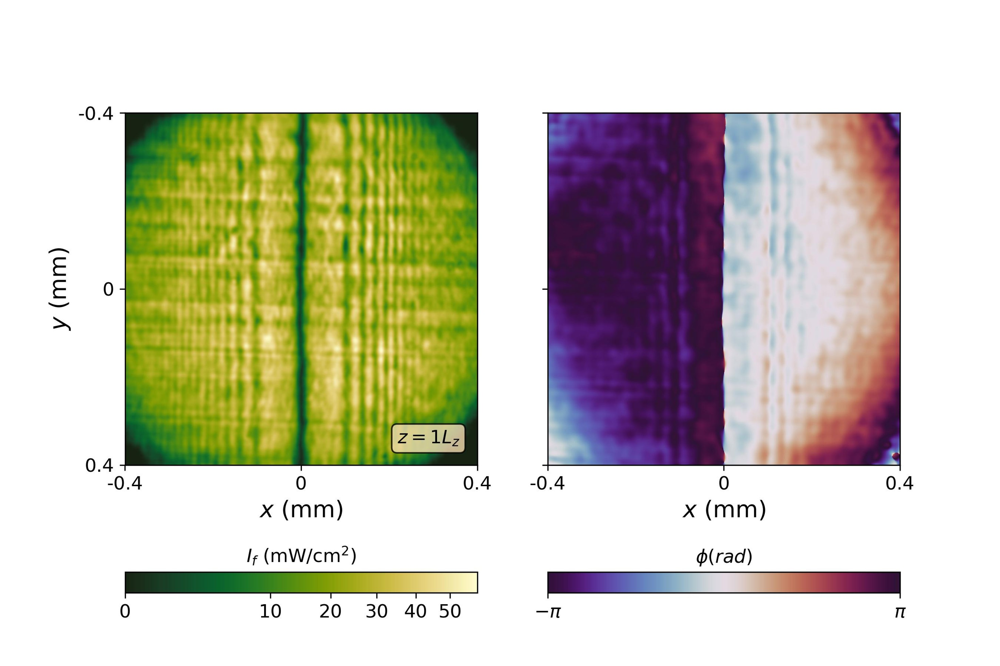
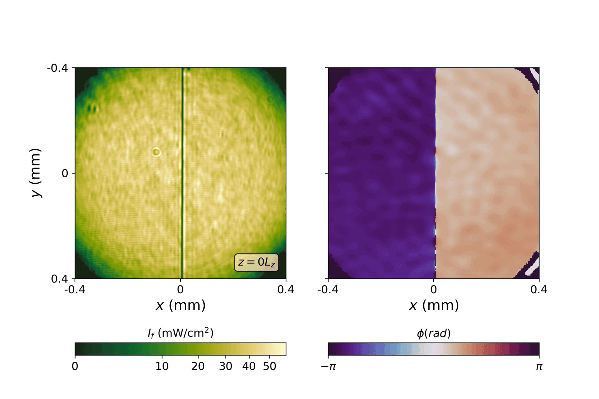
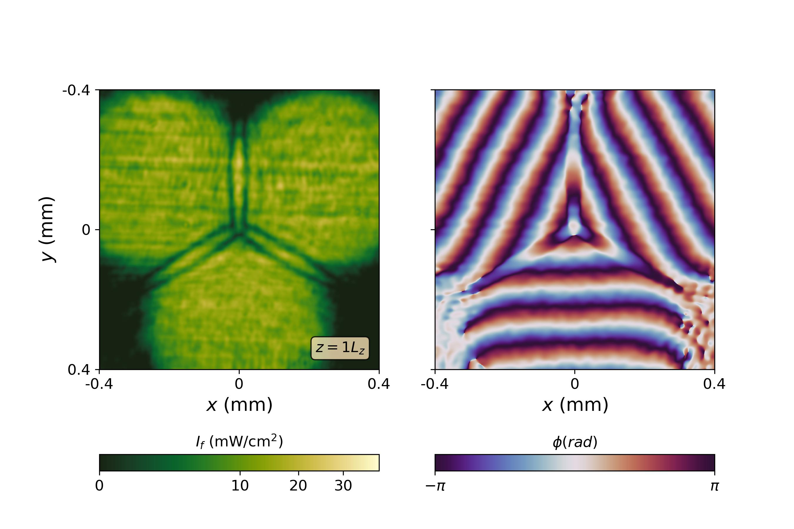

Our team has published a new paper published in Physical Review Letter: [Digital Feedback Loop in Paraxial Fluids of Light: A Gate to New Phenomena in Analog Physical Simulations](https://journals.aps.org/prl/abstract/10.1103/PhysRevLett.133.243802)

## Introduction

Paraxial Fluids of Light are an intriguing platform for emulating quantum-like phenomena using low-cost experimental setups. This analogy arises from the fact that, when a beam of light propagates through a nonlinear optical medium under the paraxial approximation, its envelope is governed by a nonlinear Schrödinger equation — the same equation that describes a Bose-Einstein condensate within the mean-field approximation. In this framework, the spatial propagation axis of the beam is mapped onto an effective time coordinate. Consequently, the analogue fluid is two-dimensional, and each slice along the propagation direction represents the state of the fluid at a different moment in time. The diffraction term plays the role of an effective mass, while the nonlinearity mediates interactions between photons, completing the fluid analogy.

Although these platforms have successfully emulated a range of dynamics, including superfluidity and quantum turbulence, they are inherently limited by the physical length of the nonlinear medium. Moreover, experimental access is typically restricted to the output state, making it challenging to monitor the evolution of the system over time.

To overcome these limitations, our team has developed a digital optical feedback system that effectively extends the propagation distance of the analogue simulation and enables access to intermediate states. The conceptual framework, technical implementation, and experimental demonstration of this feedback loop are at the core of our recently [published paper](https://journals.aps.org/prl/abstract/10.1103/PhysRevLett.133.243802).

 

## Experimental Implementation

To overcome the inherent limitations of analogue simulations with paraxial fluids of light—namely the restricted propagation length and lack of access to intermediate states—we developed a digital optical feedback loop. The system is implemented using a photorefractive crystal as the nonlinear medium, which enables light–light interactions essential for emulating fluid dynamics. We also employ advanced wavefront shaping techniques to modulate the amplitude and phase profiles of the beam with high fidelity, ensuring accurate reconstruction and reinjection of the optical field. This setup captures the complex output field using holographic techniques and reinjects it as the input field for a subsequent propagation stage. By iteratively applying this process, we effectively extend the simulation “time” and gain insight into the intermediate dynamics of the system.

This approach not only enhances the versatility of paraxial fluids of light as analogue quantum simulators but also opens new avenues for observing long-time evolutions and complex phenomena that were previously inaccessible. The method provides a powerful experimental tool for exploring nonlinear dynamics, turbulence, and quantum-like behavior with unprecedented control.
<figure style="display: flex; flex-direction: column; align-items: center; margin: 2rem auto; text-align: center;">
  
  <figcaption style="font-style: italic; font-size: 0.9rem; color: #666; margin-top: 0.5rem;">Figure 1 - Schematic and conceptual scheme of the digital feedback loop.</figcaption>
</figure>

## Experimental Results

We tested the digital feedback loop in two distinct configurations. First, we investigated the decay of a dark soliton to observe the expansion of shock waves and the development of snake instability, which subsequently decays into vortex pairs. The corresponding results are presented in Figure 2 and compared with the previous method, which only monitored the output without accessing intermediate dynamics. Second, we explored the collision of three flat-top states to demonstrate the setup’s capability to generate nontrivial initial conditions. This scenario led to the formation of a vortex lattice at the center, as shown in Figure 3.

  <figure>
    
    <figcaption>Figure 2a – Decay of a dark soliton using the previous experimental configuration. Only a single passage through the crystal was accessible.</figcaption>
  </figure>

  <figure>
    
    <figcaption>Figure 2b – Decay of a dark soliton using the digital feedback loop configuration. This setup provides access to intermediate states and effectively increases the crystal’s length by a factor of  $ 7$.</figcaption>
  </figure>

  <figure>
    
    <figcaption>Figure 2a – Collision between three flat-top states using the previous experimental configuration. Only a single passage through the crystal was accessible.</figcaption>
  </figure>

  <figure>
    
    <figcaption>Figure 2b – Collision between three flat-top states the digital feedback loop configuration. This setup provides access to intermediate states and effectively increases the crystal’s length by a factor of  $ 8$.</figcaption>
  </figure>

For more details about the digital feedback loop, see Tiago D. Ferreira’s [Ph.D. thesis](https://hdl.handle.net/10216/159180).

# Next Steps

We now working with multiple component digital feedback loop to create more complex analogue simulations with paraxial fluids of light.

