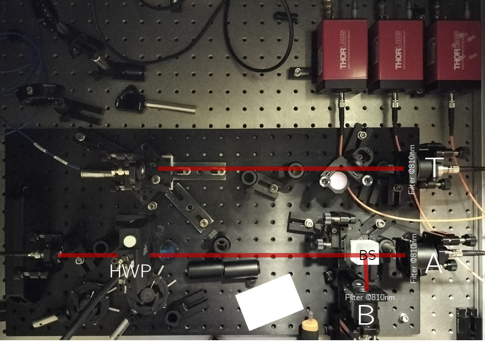

Our research team is excited to announce the first experimental measurements of the quantum properties of light.

## Introduction

Recently, our team at the Centre of Applied Photonics at INESC TEC has initiated efforts toward quantum imaging and sensing, an important and rapidly evolving research field. To support this initiative, we have acquired essential equipment, including a single-photon source, single-photon detectors, a Time Tagger, and various optical components.

As an initial test and experimental demonstration of our setup's capabilities, we performed the Grangier, Roger, and Aspect (GRA) experiment. In simple terms, this experiment involves generating pairs of photons. One photon from each pair is sent directly to a single-photon detector, serving as a herald (idler photon) that indicates the presence of a single photon in the opposite arm. The second photon passes through a $50/50$ beam splitter, and the resulting two outputs are detected individually by single-photon detectors labeled A and B. 

## Experimental Implementation

The simple experimental setup employed in this initial study is illustrated in Figure 1
<figure style="display: flex; flex-direction: column; align-items: center; margin: 2rem auto; text-align: center;">
  
  <figcaption style="font-style: italic; font-size: 0.9rem; color: #666; margin-top: 0.5rem;">Figure 1 - Experimental Setup.</figcaption>
</figure>

In the GRA experiment, we use the herald detector at position $T$ to condition the detection events at detectors $A$ and $B$. Specifically, we only look for counts in detectors $A$ and $B$ when a photon is detected at $T$. This conditional measurement ensures that, within the coincidence window, we can state with high certainty that a single-photon Fock state is present in the other arm. Under these conditions, the second-order correlation function is given by

$$g^{(2)}_{GRA}(0)=\frac{P_{TAB}}{P_{TA}P_{TB}}$$

where $P_{TAB}$ is the conditional probability of observing a triple coincidence in all three detectors, and $P_{Ti}$ are the probabilities of observing double coincidences involving detector $T$ and detector $i$.

Depending on the specific light source, we have the following scenarios:
<ul>
  <li>$g^{(2)}_{RGA}(0)\approx0$ - Single Photons</li>
  <li>$g^{(2)}_{RGA}(0)\approx1$ - Laser Light</li>
  <li>$g^{(2)}_{RGA}(0)\gtrapprox 1$ - Thermal Light</li>
</ul>

## Experimental Results

As expected, we clearly observe a pronounced dip at $\tau = 0$, and the experimentally measured second-order correlation function is
<figure style="display: flex; flex-direction: column; align-items: center; margin: 2rem auto; text-align: center;">
  
  <figcaption style="font-style: italic; font-size: 0.9rem; color: #666; margin-top: 0.5rem;">Figure 2 - Second order correlation function as a function of the delay $\tau$ for the GRA experiment.</figcaption>
</figure>

As expected. we clearly observe a deep for $\tau=0$, the the experimental second order correlation function gives 
$$g^{(2)}_{GRA}(0)\approx0.031\pm0.004$$
For larger delays, the photons become uncorrelated, yielding values close to $\approx 1$. This behavior demonstrates the particle-like nature of single photons.

# Next Steps

The team is now changing the experiment to implement a Hong-Ou-Mandel setup, moving towards quantum imaging applications. 

