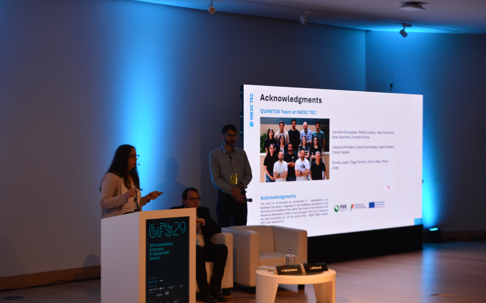
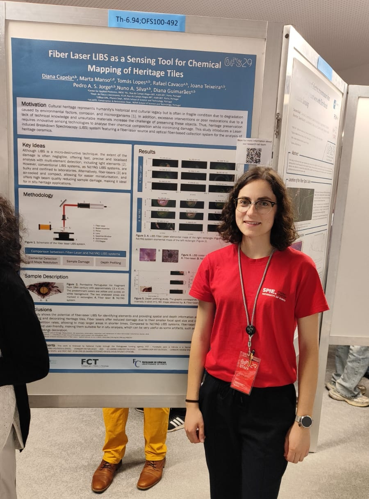
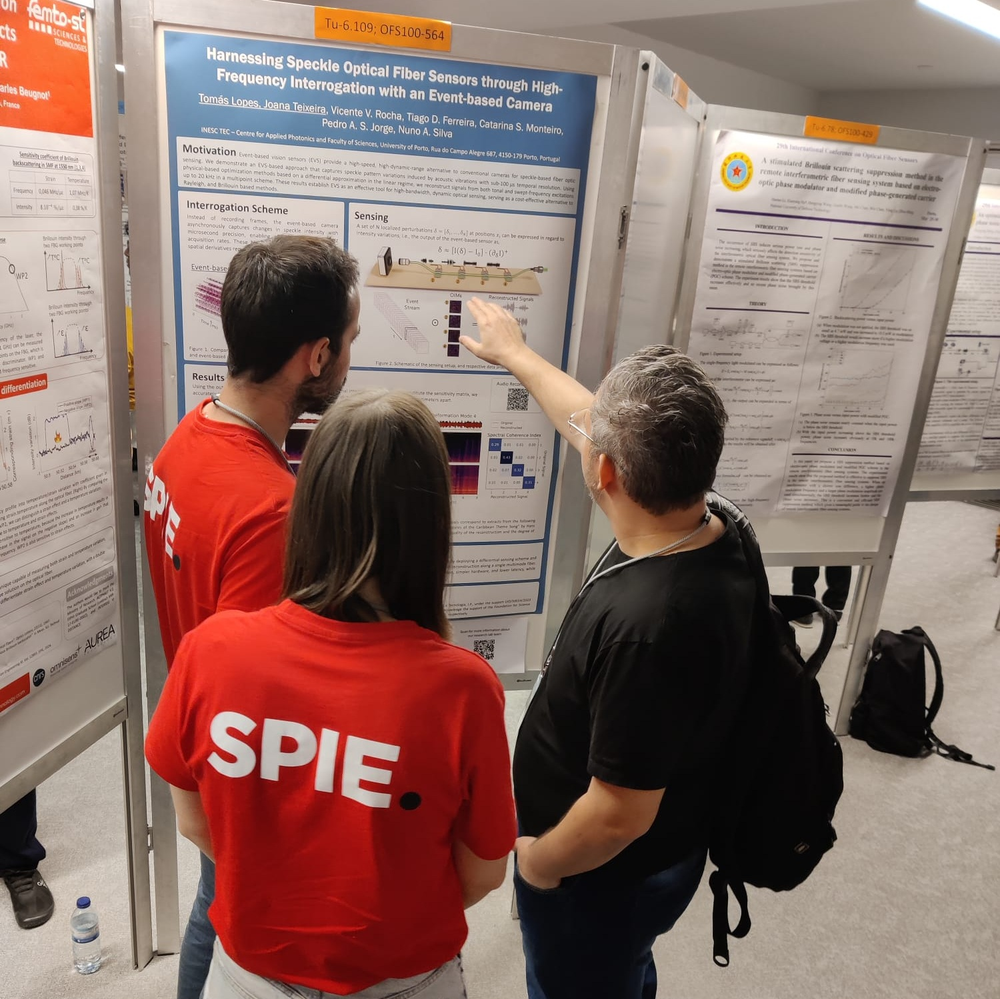

Last week, the Quantos team presented three works at the 29th International Conference on Optical Fiber Sensors (OFS-29), held May 25–30, 2025, at the Super Bock Arena in Porto, Portugal. OFS-29 is the flagship biennial forum for researchers and industry professionals working on photonic sensing and fiber-optic sensor technologies. Over the five-day program, plenary and invited talks, contributed oral and poster presentations, technical workshops, and a commercial exhibition showcased the latest advances in fiber-optic sensing applications.

## [Enhancing a Polarimetric Fiber Sensor Using Fisher Information](https://doi.org/10.1117/12.3062938) (Oral Presentation)

Catarina Monteiro presented this oral paper, coauthored together with Tiago D. Ferreira, Carolina Gonçalves, Orlando Frazão, and Nuno A. Silva. They applied Fisher information theory to optimize the design of polarimetric fiber sensors. By formulating the sensor’s response in terms of the Mueller matrix formalism, the team derived theoretical limits on measurement precision and identified operating points that maximize information gain for a given noise level. Comparing the standard sensor configuration to the Fisher-optimized configuration, they demonstrated approximately a twofold improvement in strain resolution under the Fisher-optimized settings. This information-theoretic design strategy paves the way for ultra-sensitive polarimetric fiber sensors in applications such as structural health monitoring and precision metrology.
<figure style="display: flex; flex-direction: column; align-items: center; margin: 2rem auto; text-align: center;">
  
  <figcaption style="font-style: italic; font-size: 0.9rem; color: #666; margin-top: 0.5rem;">Figure 1 - Catarina oral presentation at OFS-29</figcaption>
</figure>

## [Fiber Laser LIBS as a Sensing Tool for Chemical Mapping of Heritage Tiles](https://doi.org/10.1117/12.3062899) (Poster Presentation)

Led by Diana Capela along with Marta Manso, Tomás Lopes, Rafael Cavaco, Joana Teixeira, Pedro A. S. Jorge, Nuno A. Silva, and Diana Guimarães, this work introduced a novel Laser-Induced Breakdown Spectroscopy (LIBS) system that employs a fiber laser source coupled with an optical fiber–based collection scheme to perform rapid, in situ chemical mapping of historical glazed tile samples . By integrating a high-pulse-energy fiber laser with flexible fiber-optic probes, the team demonstrated sub-millimeter–scale spatial resolution in detecting element distributions (e.g., Ca, Fe, Pb) on 18th-century tile fragments without damaging the delicate surfaces. This approach promises a non-destructive alternative for conservation scientists to monitor degradation pathways and inform restoration strategies for Portugal’s cultural heritage.

<figure style="display: flex; flex-direction: column; align-items: center; margin: 2rem auto; text-align: center;">
  
  <figcaption style="font-style: italic; font-size: 0.9rem; color: #666; margin-top: 0.5rem;">Figure 2 - Diana Capela poster presentation.</figcaption>
</figure>

## [Harnessing Speckle Optical Fiber Sensors through High-Frequency Interrogation with an Event-Based Camera](https://doi.org/10.1117/12.3063005) (Poster Presentation)

Tomás Lopes, Joana Teixeira, Vicente V. Rocha, Tiago D. Ferreira, Catarina S. Monteiro, Pedro A. S. Jorge, and Nuno A. Silva showcased a pioneering interrogation scheme that leverages an event-based camera to capture multimode-fiber speckle patterns at kilohertz frame rates . By dynamically sampling speckle evolution rather than relying on conventional frame-integration methods, the team achieved sub-microsecond temporal resolution in detecting fiber perturbations (strain, vibration). In proof-of-concept experiments, the system resolved simulated acoustic disturbances up to 5 kHz, demonstrating its potential for optical metrology and dynamic sensing applications, where rapid detection of high-frequency events is critical.

<figure style="display: flex; flex-direction: column; align-items: center; margin: 2rem auto; text-align: center;">
  
  <figcaption style="font-style: italic; font-size: 0.9rem; color: #666; margin-top: 0.5rem;">Figure 3 - Tomás and Joana poster presentation.</figcaption>
</figure>

The QUANTOS would like to thank the OFS-29 organizers and all attendees who provided valuable feedback to our works. 