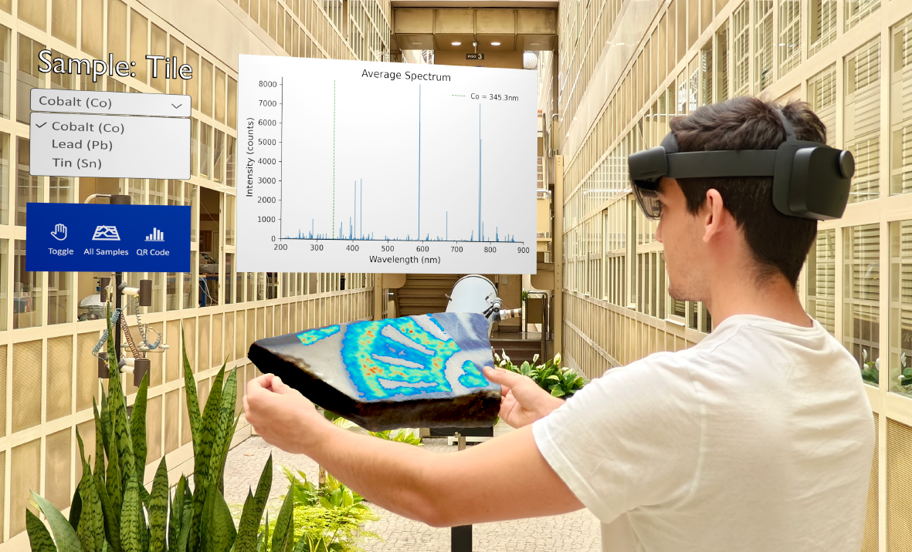

## [New paper published in Applied Sciences: Beyond Human Vision: Unlocking the Potential of Augmented Reality for Spectral Imaging](https://www.mdpi.com/2076-3417/15/12/6635)

"Beyond Human Vision: Unlocking the Potential of Augmented Reality for Spectral Imaging" has been recently published in Applied Sciences and describes an interesting approach to data visualization in Spectral Imaging using Augmented Reality devices.

<figure style="display: flex; flex-direction: column; align-items: center; margin: 2rem auto; text-align: center;">
  
  <figcaption style="font-style: italic; font-size: 0.9rem; color: #666; margin-top: 0.5rem;">Figure 1 - Real-time demonstration of augmented reality–powered spectral imaging visualization.</figcaption>
</figure>

The full paper can be accessed [here](https://www.mdpi.com/2076-3417/15/12/6635).

