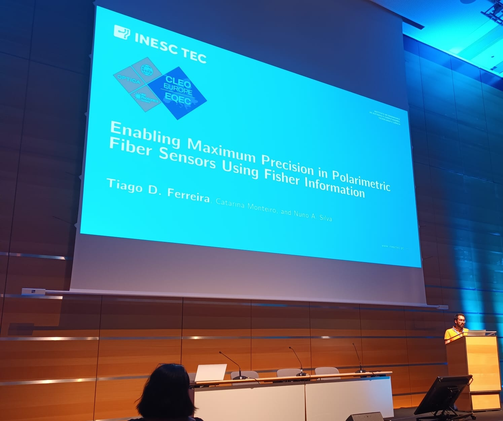
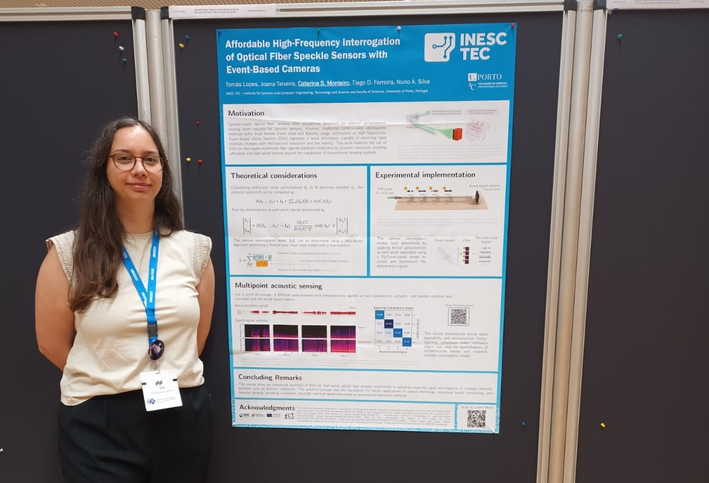
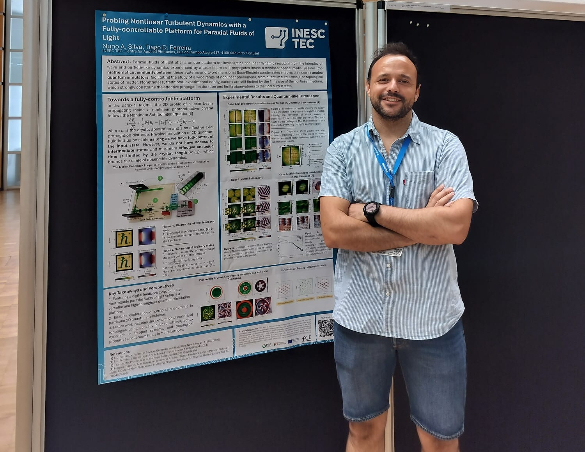

The Quantos team presented three works at the CLEO®/Europe-EQEC, held June 23 - 27, at ICM – International Congress Center of Messe München, Germany.

## Enabling Maximum Precision in Polarimetric Fiber Sensors Using Fisher Information (Oral Presentation)
Authors: **Tiago D. Ferreira**, Catarina Monteiro, and Nuno A. Silva 

This work employs the Mueller matrix formalism and Fisher information for enabling maximum precision in polarimetric fiber sensors. Optimizing input polarization states enhances accuracy in deformation detection, facilitating high resolution monitoring and advanced diagnostic applications.
<figure style="display: flex; flex-direction: column; align-items: center; margin: 2rem auto; text-align: center;">
  
  <figcaption style="font-style: italic; font-size: 0.9rem; color: #666; margin-top: 0.5rem;">Figure 1 - Tiago oral presentation at CLEO®/Europe-EQEC</figcaption>
</figure>

## Afordable High-Frequency Interrogation of Optical Fiber Speckle Sensors with Event-Based Cameras  (Poster Presentation)
Authors: Tomás Lopes, Joana Teixeira, **Catarina S. Monteiro**, Tiago D. Ferreira, and Nuno A. Silva 

Speckle-based fiber sensors are known for their sensitivity but are typically constrained by camera frame rates and dynamic range. In this presentation, we demonstrate the potential of event-based cameras for high-speed interrogation of speckle-based sensors.

<a href="../../posts/post_2025_07_02/Poster-CLEO_catarina.pdf" target="_blank" rel="noopener">Click here to see the poster</a>
<figure style="display: flex; flex-direction: column; align-items: center; margin: 2rem auto; text-align: center;">
  
  <figcaption style="font-style: italic; font-size: 0.9rem; color: #666; margin-top: 0.5rem;">Figure 2 - Catarina poster presentation at CLEO®/Europe-EQEC</figcaption>
</figure>

## Probing Nonlinear Turbulent Dynamics with a Fully-controllable Platform for Paraxial Fluids of Light (Poster Presentation)
Authors: **Nuno A. Silva** and Tiago Ferreira

Using an optical feedback loop enabled by digital holography and wavefront shaping, we investigate nonlinear dynamics in paraxial fluids of light in a photorefractive crystal. Featuring extended propagation dynamics, it allows observation of quantum-like turbulence.

<a href="../../posts/post_2025_07_02/poster_cleo_NUNO.pdf" target="_blank" rel="noopener">Click here to see the poster</a>
<figure style="display: flex; flex-direction: column; align-items: center; margin: 2rem auto; text-align: center;">
  
  <figcaption style="font-style: italic; font-size: 0.9rem; color: #666; margin-top: 0.5rem;">Figure 3 - Nuno poster presentation at CLEO®/Europe-EQEC</figcaption>
</figure>