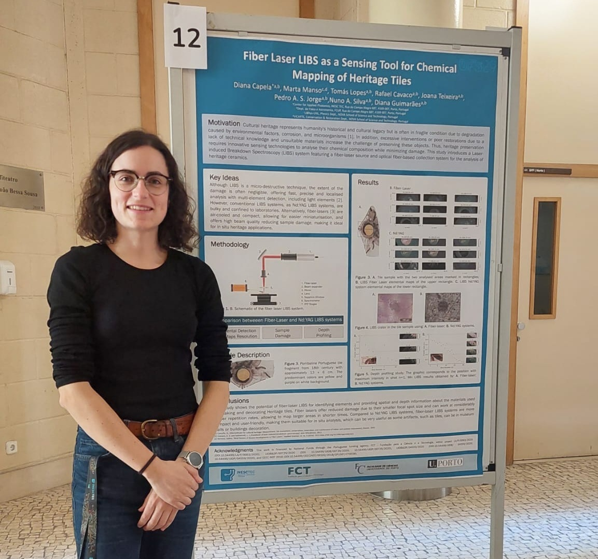

Diana Capela, a PhD researcher at INESC TEC, was awarded the PhD Best Poster Award at the ESP Young Minds U. Porto Poster Contest 2025 for her work titled: **Fiber Laser LIBS as a Sensing Tool for Chemical Mapping of Heritage Tiles**, developed in the field of Experimental Physics (Optics).

The study introduces an innovative LIBS approach using a fiber laser system for high-resolution chemical analysis of heritage tiles, enhancing spatial resolution and efficiency and minimizing damage to delicate surfaces.

Supervised by Diana Guimarães and Nuno Silva, her research was recognized during the poster contest held at the Faculty of Sciences of the University of Porto, supported by the European Physical Society (EPS) and organized by PhysikUP and the SPIE Student Chapter.

<figure style="display: flex; flex-direction: column; align-items: center; margin: 2rem auto; text-align: center;">
  
  <figcaption style="font-style: italic; font-size: 0.9rem; color: #666; margin-top: 0.5rem;">Figure 1 - Diana poster presentation</figcaption>
</figure>