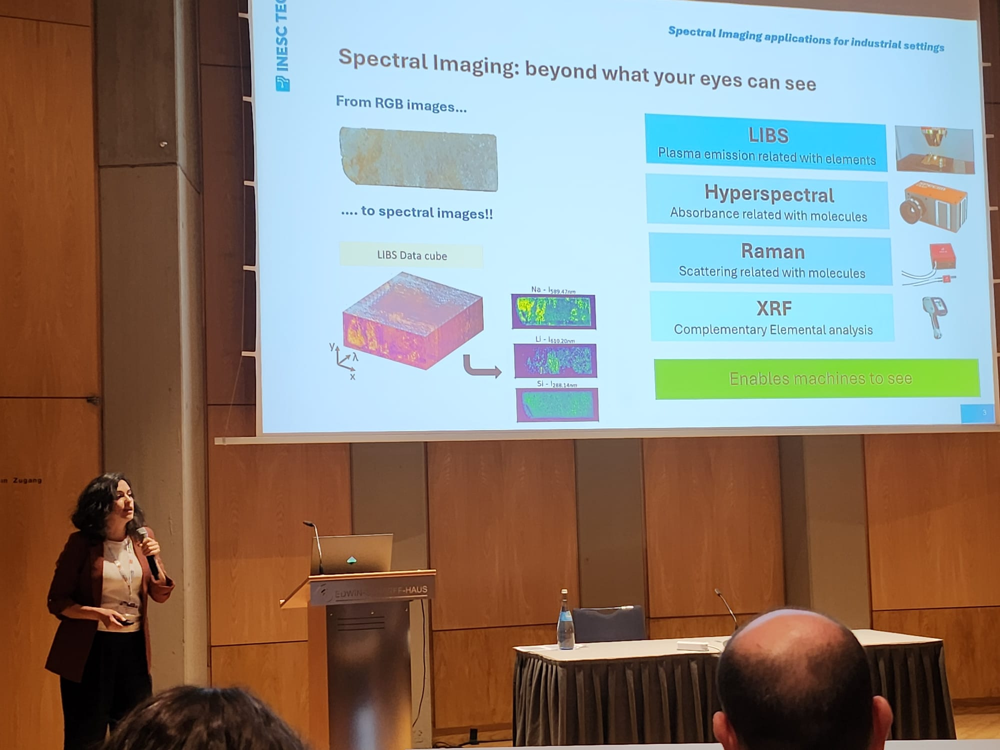

The Colloquium Spectroscopicum Internationale (CSI) is one of the most established international conferences in the field of analytical spectroscopy, with its first edition dating back to 1950. Dedicated to both fundamental research and applied developments, CSI provides a global forum for scientists across all branches of spectroscopy.

The 44th edition (CSI XLIV) was held in Ulm, Germany, from July 27th to 31st, 2025. Representing INESC TEC and the QUANTOS Team from the Centre of Applied Photonics, Diana Guimarães was an invited speaker in the session on Imaging Techniques, where she presented the talk **Spectral Imaging Applications for Industrial Settings: On-Site, At-Line, and In-Sight**. The presentation focused on the use of advanced spectral imaging methods, such as LIBS, Raman and hyperspectral imaging, to support real-time decision-making in industrial environments.

<figure style="display: flex; flex-direction: column; align-items: center; margin: 2rem auto; text-align: center;">
  
  <figcaption style="font-style: italic; font-size: 0.9rem; color: #666; margin-top: 0.5rem;">Figure 1 - Diana Guimarães presentation.</figcaption>
</figure>