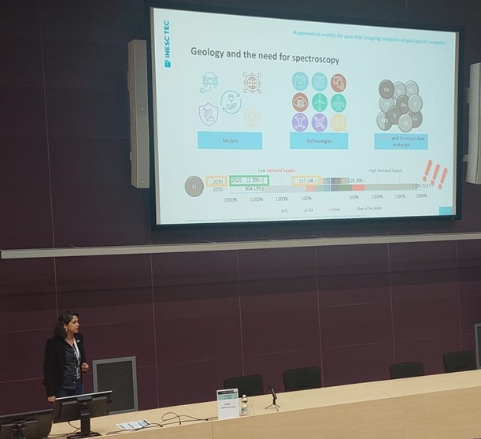
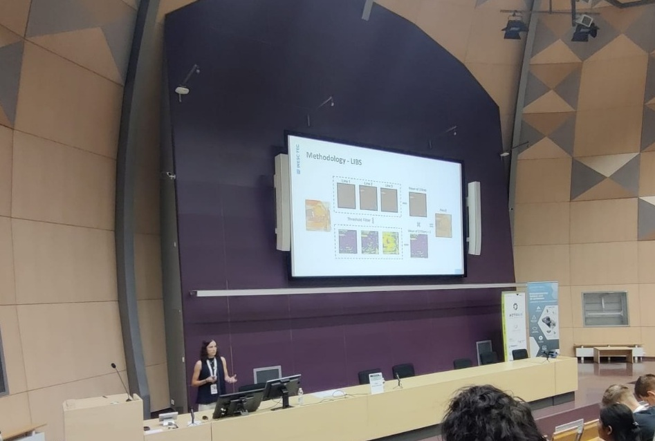
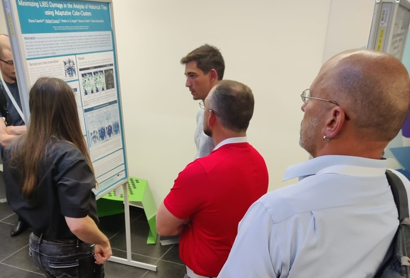
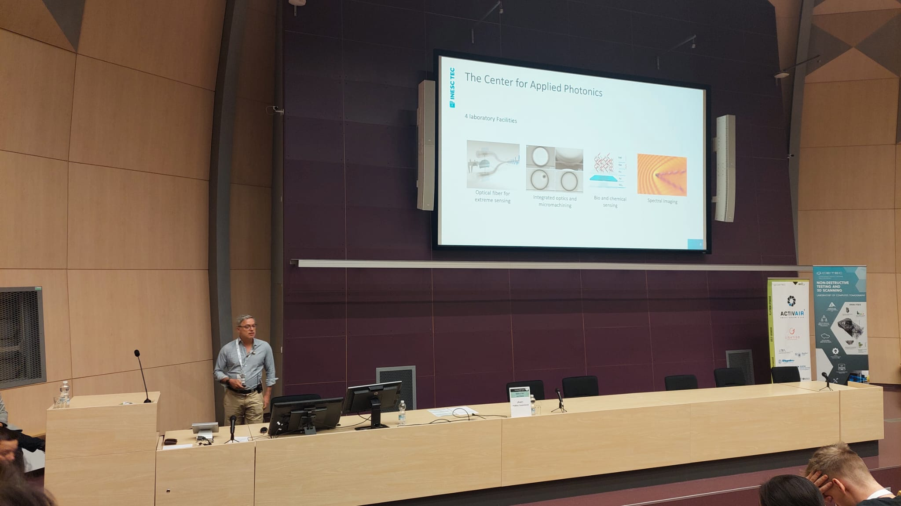

From August 26th to 28th, 2025, the QUANTOS team participated in the 5th International Symposium on Advanced Measurement, Analysis, and Control for Energy and Environment (AMACEE), held in Brno, Czech Republic.

Our group contributed actively to the scientific program with three oral presentations and the presentation of a research poster. We are proud to share that the poster presentation was distinguished with the Best Poster Award, recognizing the relevance and quality of our work.

## Augmented Reality For Spectral Imaging Analysis Of Geological Samples  (Oral Presentation)
Authors: Rafael Cavaco, Tomás Lopes, Diana Capela, Catarina Monteiro, Joana Teixeira, Pedro A.S. Jorge, **Diana Guimarães**,Nuno A. Silva

This work introduces an Augmented Reality (AR) framework that integrates spectral imaging data from Laser-Induced Breakdown Spectroscopy (LIBS) and Raman with interactive 3D visualization. 
<figure style="display: flex; flex-direction: column; align-items: center; margin: 2rem auto; text-align: center;">
  
  <figcaption style="font-style: italic; font-size: 0.9rem; color: #666; margin-top: 0.5rem;">Figure 1 - Diana Guimarães oral presentation at AMACEE</figcaption>
</figure>

## Laser-Induced Breakdown Spectroscopy System For   At-Line Sorting Of Recycled Wood  (Oral Presentation)
Authors: **Diana Capela**, Rafael Cavaco, João Carvalho, Pedro A.S. Jorge, Nuno A. Silva, Diana Guimarães

Presentation of a Laser-Induced Breakdown Spectroscopy (LIBS) system for at-line detection of contaminants in recycled wood. Without the need for sample preparation, it incorporates a vision system that tracks the position of wood samples on an industrial conveyor belt and performs sample segmentation and position detection in real time using the YOLO algorithm. 

<figure style="display: flex; flex-direction: column; align-items: center; margin: 2rem auto; text-align: center;">
  
  <figcaption style="font-style: italic; font-size: 0.9rem; color: #666; margin-top: 0.5rem;">Figure 2 - Diana Capela oral presentation at AMACEE</figcaption>
</figure>

## Minimizing Libs Damage In The Analysis Of Historical Tiles Using Adaptive Color-Clusters (Poster Presentation)
Authors: Diana Capela, **Rafael Cavaco**, Pedro A.S. Jorge, Nuno A. Silva, Diana Guimarães

This work proposes a novel strategy that integrates spectral and RGB data clustering to identify visually and chemically identical regions. By comparing the regions obtained from both clustering approaches, the method will lead to a reduction in the number of measurements required, thus preserving the integrity of cultural heritage artefacts while still delivering reliable compositional insights.

<a href="../../posts/post_2025_09_12/poster_amacee.pdf" target="_blank" rel="noopener">Click here to see the poster</a>
<figure style="display: flex; flex-direction: column; align-items: center; margin: 2rem auto; text-align: center;">
  
  <figcaption style="font-style: italic; font-size: 0.9rem; color: #666; margin-top: 0.5rem;">Figure 3 - Rafael Cavaco poster presentation at AMACEE</figcaption>
</figure>

## Photonic Tools For Smarter Monitoring In Industry, Environment, And Biomedicine  (Oral Presentation)
Authors: **Pedro Jorge**, Diana Guimarães, Nuno A. Silva

Focusing on recent scientific and technological development at INESC TEC, this presentation showcases industrial tools for real-time characterization and sorting in recycling (glass, wood), novel approaches to cork quality control, and advanced sensing for mining, alongside solutions for biomedical diagnostics and environmental monitoring.
<figure style="display: flex; flex-direction: column; align-items: center; margin: 2rem auto; text-align: center;">
  
  <figcaption style="font-style: italic; font-size: 0.9rem; color: #666; margin-top: 0.5rem;">Figure 4 - Pedro Jorge oral presentation at AMACEE</figcaption>
</figure>