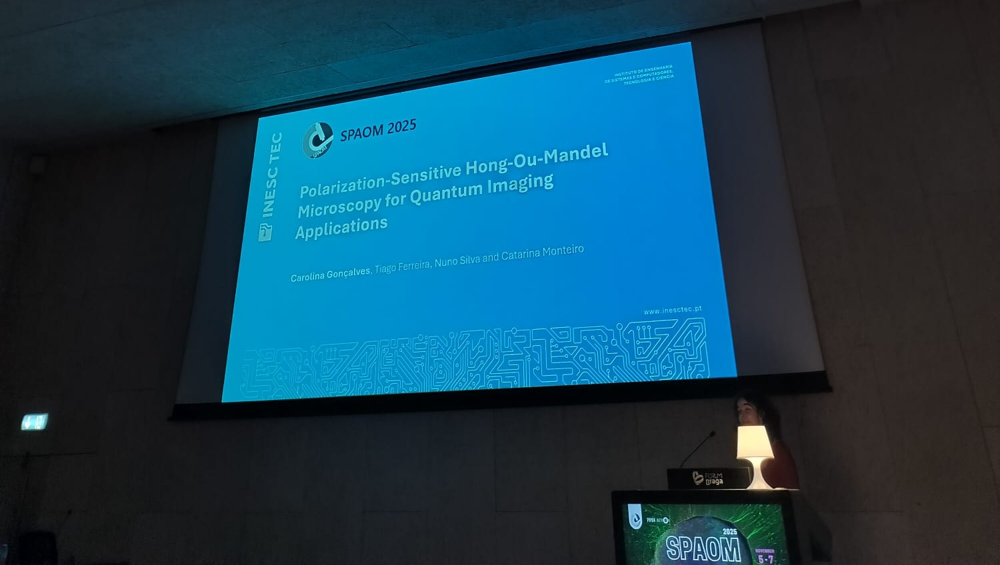
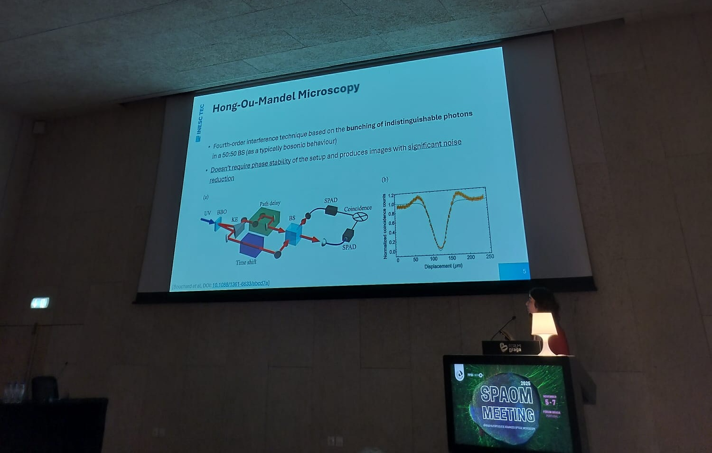

From November 5th to 7th 2025, the QUANTOS team took part in the 9th Spanish and Portuguese Advanced Optical Microscopy Meeting (SPAOM), which took place in Braga, Portugal. Our group contributed actively to the scientific program with one of the selected oral presentations in the first ever session on Quantum Bioimaging and Sensing in this conference. Our talk, entitled Polarization-Sensitive Hong-Ou-Mandel Microscopy for Quantum Imaging Applications, was the culmination of several months of dedicated work by Carolina R. Gonçalves (who presented at the conference), Tiago D. Ferreira, Catarina Monteiro and Nuno A. Silva.

We introduced the first quantum interferometer developed at CAP, as well as its potential for birefringence imaging with quantum-enhanced resolution. Our presence in this conference allows us to evaluate not only the need for quantum-enhanced imaging systems, but also its applicability to biological and biomedical sciences.

<figure style="display: flex; flex-direction: column; align-items: center; margin: 2rem auto; text-align: center;">
  
  <figcaption style="font-style: italic; font-size: 0.9rem; color: #666; margin-top: 0.5rem;">Figure 1 - Carolina Presenting at SPAOM 2025.</figcaption>
</figure>

<figure style="display: flex; flex-direction: column; align-items: center; margin: 2rem auto; text-align: center;">
  
  <figcaption style="font-style: italic; font-size: 0.9rem; color: #666; margin-top: 0.5rem;">Figure 2 - Presentation at SPAOM 2025.</figcaption>
</figure>

<figure style="display: flex; flex-direction: column; align-items: center; margin: 2rem auto; text-align: center;">
  
  <figcaption style="font-style: italic; font-size: 0.9rem; color: #666; margin-top: 0.5rem;">Figure 3 - Presentation at SPAOM 2025.</figcaption>
</figure>