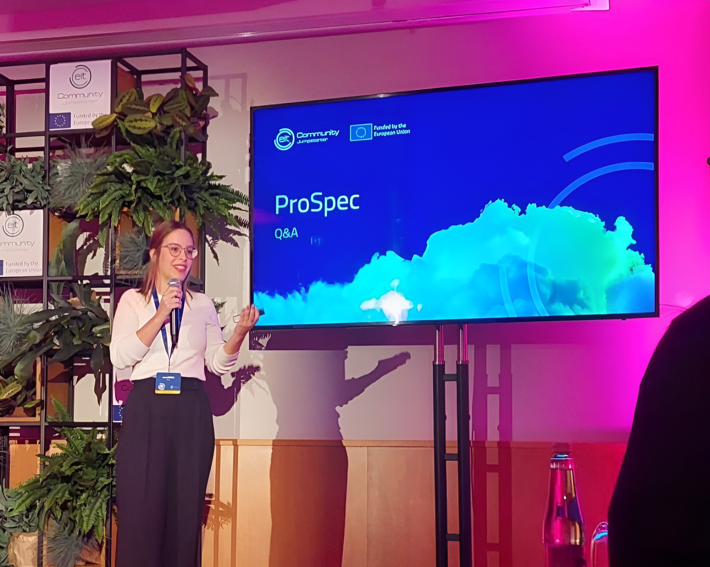
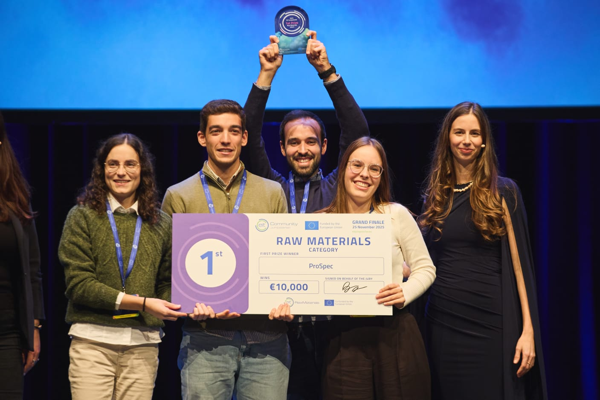

The QUANTOS team highlights its participation in the EIT Jumpstarter 2025, where its spin-off initiative, ProSpec, was awarded 1st Prize in the Raw Materials category at the EIT Innovation Awards, the final stage of the European Institute of Innovation & Technology (EIT) pre-acceleration program.

ProSpec stood out among 42 finalist teams from 17 European countries in the Raw Materials category. The distinction recognizes a solution that combines spectroscopy techniques with proprietary data analysis software to enable real-time, in-situ characterization and valorization of materials. The award included a €10,000 prize, underlining the industrial relevance of the proposed technology.

Selected from over 900 applications across Europe, the team took part in an intensive seven-month acceleration program, during which both the technological and business aspects of the project were further developed. The resulting platform enables fast, on-site material analysis without the need for offsite laboratory processing, addressing key challenges in sectors such as mining and secondary raw material processing.

<figure style="display: flex; flex-direction: column; align-items: center; margin: 2rem auto; text-align: center;">
  
  <figcaption style="font-style: italic; font-size: 0.9rem; color: #666; margin-top: 0.5rem;">Figure 1 - Presentation at EIT Jumpstarter finals.</figcaption>
</figure>

The solution builds on research developed at CAP in the field of photonics and spectral imaging, where collaborations with industrial partners such as BAGlass, Savannah Resource, Sonae, and Egitron was essential to identify practical constraints and opportunities, ensuring that the proposed system addresses real operational needs.

By enabling automated, realtime material analysis, ProSpec contributes to more efficient, accurate, and sustainable industrial decision-making, reducing delays, minimizing human error, and lowering environmental impact. The technology is implemented as a modular hardware–software solution, adaptable to different operational contexts and compliant with industrial requirements.

This result reflects the QUANTOS team’s ongoing efforts to translate advanced optical and photonic research into technologies with direct industrial impact.

<figure style="display: flex; flex-direction: column; align-items: center; margin: 2rem auto; text-align: center;">
  
  <figcaption style="font-style: italic; font-size: 0.9rem; color: #666; margin-top: 0.5rem;">Figure 2 - Award ceremony with the full team</figcaption>
</figure>