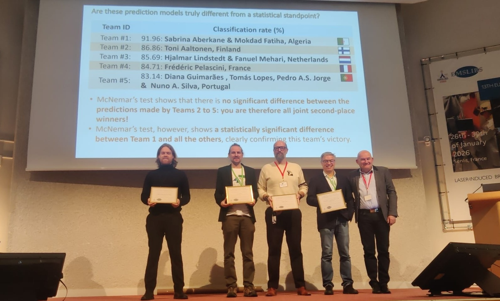
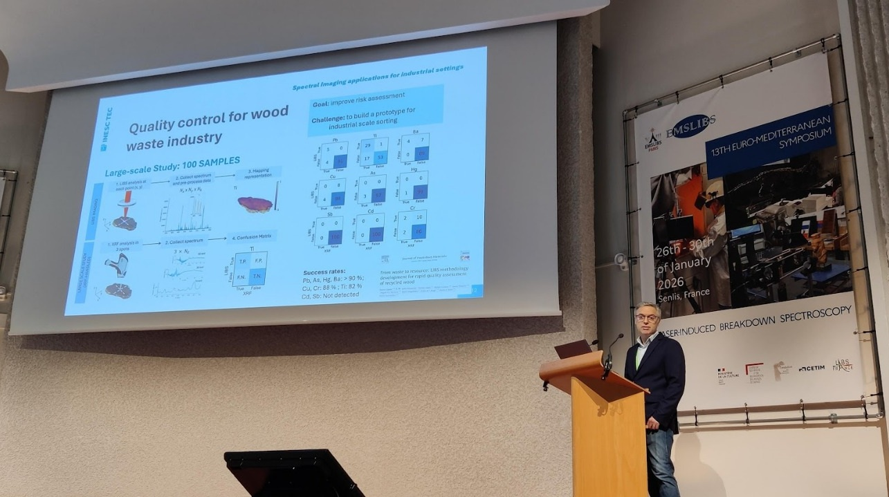
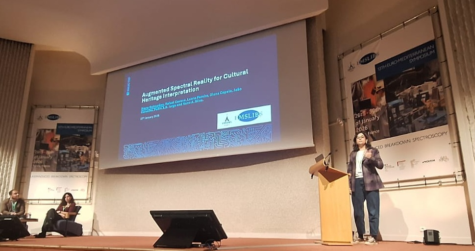
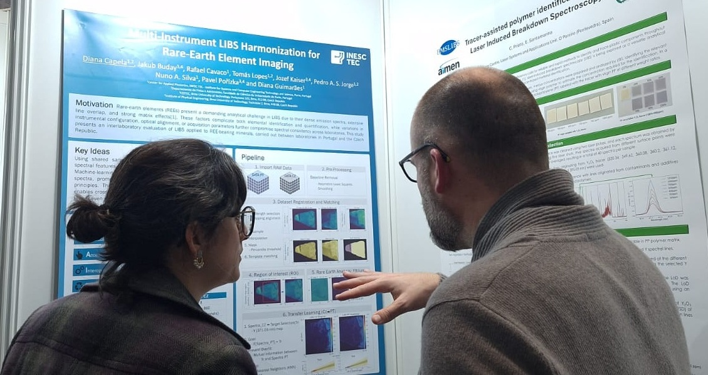

Researchers from QUANTOS participated in EMSLIBS 2025 (International Conference on Laser-Induced Breakdown Spectroscopy), held in Senlis, France from 26th to 30th January 2026. The conference brought together the international LIBS community to discuss recent methodological advances and emerging applications of the technique.

## Second place in the EMSLIBS 2025 Data Challenge

One of the main highlights was the achievement of second place, from 18 participating teams, in the EMSLIBS 2025 Data Challenge. This challenge focused on a supervised classification problem using raw LIBS spectra acquired with a portable system and was addressed by our phD student Tomás Lopes with the main supervision of Prof. Nuno Silva. The challenge aimed to assess robust data-processing and machine-learning strategies under realistic, field-oriented acquisition conditions. This result reinforces QUANTOS expertise in data-driven LIBS analysis, particularly in handling raw spectra and applying out-of-the box machine learning solutions. A future paper will be published with the approach of the 5 best teams.
<figure style="display: flex; flex-direction: column; align-items: center; margin: 2rem auto; text-align: center;">
  
  <figcaption style="font-style: italic; font-size: 0.9rem; color: #666; margin-top: 0.5rem;">Figure 1 - Award ceremony.</figcaption>
</figure>
<figure style="display: flex; flex-direction: column; align-items: center; margin: 2rem auto; text-align: center;">
  
  <figcaption style="font-style: italic; font-size: 0.9rem; color: #666; margin-top: 0.5rem;">Figure 2 - Award Certificate.</figcaption>
</figure>

## Oral and poster contributions across multiple domains

INESC TEC researchers also contributed actively to the scientific programme with two oral presentations and one poster, reflecting the centre’s multidisciplinary approach to LIBS research:

- Pedro Jorge presented a work on an automated LIBS inspection system combined with machine vision for the detection of chemical contaminants in recycled wood, targeting industrial conveyor-belt conditions.
  
<figure style="display: flex; flex-direction: column; align-items: center; margin: 2rem auto; text-align: center;">
  
  <figcaption style="font-style: italic; font-size: 0.9rem; color: #666; margin-top: 0.5rem;">Figure 3 - Pedro Jorge oral presentation.</figcaption>
</figure>

- Diana Guimarães delivered an oral presentation on Augmented Spectral Reality for cultural heritage, integrating LIBS and complementary techniques with 3D representation and augmented-reality interfaces to enhance interpretation while minimising analytical damage.
  
<figure style="display: flex; flex-direction: column; align-items: center; margin: 2rem auto; text-align: center;">
  
  <figcaption style="font-style: italic; font-size: 0.9rem; color: #666; margin-top: 0.5rem;">Figure 4 - Diana Guimarães oral presentation.</figcaption>
</figure>

- The poster contribution, presented by the team (first author, phD student Diana Capela), addressed multi-instrument LIBS harmonisation for rare-earth element imaging, reporting an interlaboratory study between Portugal and the Czech Republic, CEITEC team, aimed at improving data interoperability and transfer learning using mutual information. <a href="../../posts/post_2026_02_09/Poster_Diana_Capela_EMSLIBS_2026.pdf" target="_blank" rel="noopener">Click here to see the poster</a>

<figure style="display: flex; flex-direction: column; align-items: center; margin: 2rem auto; text-align: center;">
  
  <figcaption style="font-style: italic; font-size: 0.9rem; color: #666; margin-top: 0.5rem;">Figure 5 - Poster presentation.</figcaption>
</figure>

## Strengthening international visibility and collaboration

Participation in EMSLIBS 2025 further strengthened INESC TEC’s international visibility within the LIBS community, while consolidating collaborations with leading European research groups. The results presented reflect ongoing efforts to bridge fundamental spectroscopy, advanced data analysis and real-world applications, from circular-economy challenges to heritage science and critical raw materials.
