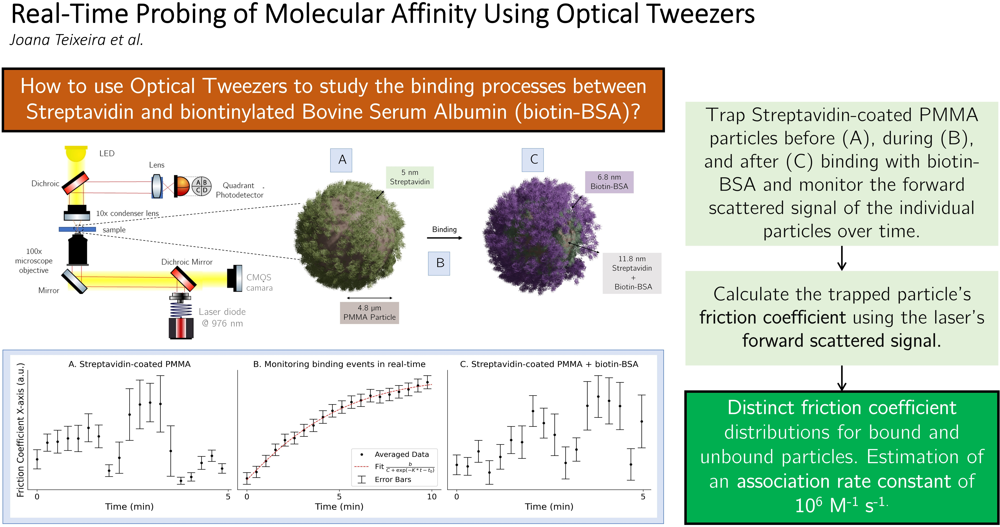

Our latest research, [Real-Time Probing of Molecular Affinity Using Optical Tweezers](https://www.mdpi.com/1424-8220/26/6/1814) has been recently published in Sensors and describes a novel, label-free methodology for monitoring molecular binding kinetics in real time.

By leveraging the precision of Optical Tweezers and advanced signal processing, the study demonstrates a non-invasive way to observe high-affinity interactions at the nanoscale.

### Key Highlights from the Study:

 - Real-Time Kinetic Tracking: Unlike conventional methods that require equilibrium or labels, this approach uses Power Spectral Density analysis of forward-scattered light to monitor binding dynamics as they happen.
 - High Sensitivity: The system successfully detected the formation of a protein monolayer (approximately 7 nm thick) on PMMA microparticles, allowing for the calculation of the association rate constant.
 - Label-Free & Versatile: This methodology eliminates the need for fluorescent tags or labor-intensive sample preparation, offering a streamlined path for studying antibodies, aptamers, and molecularly imprinted polymers.
 - Miniaturization Potential: The technique’s compatibility with microfluidic setups paves the way for portable, highly sensitive diagnostic tools.
  

This work establishes a robust foundation for using optical tweezers-based tools to probe the mechanical and optical changes of biomolecular interactions.

<!-- 

 -->
<figure style="display: flex; flex-direction: column; align-items: center; margin: 2rem auto; text-align: center;">
  
  <figcaption style="font-style: italic; font-size: 0.9rem; color: #666; margin-top: 0.5rem;">Figure 1 - Graphical Abstract</figcaption>
</figure>

