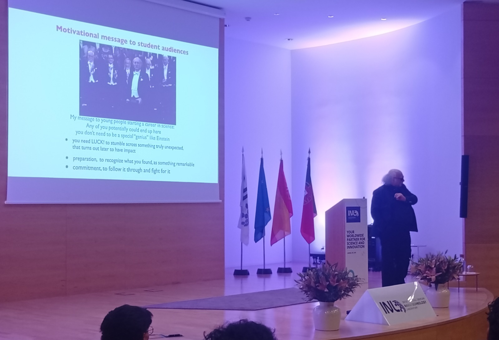
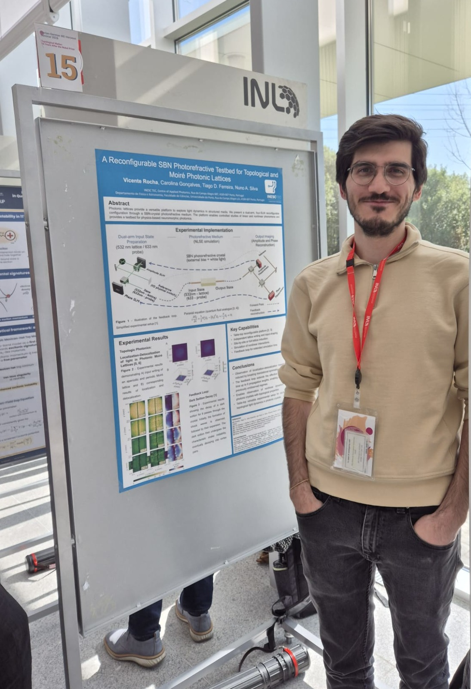

From 29th of March to the 2nd of April, Researchers from QUANTOS participated in the [Iberian-German WE-Heraeus Seminar 2026 on Topology](https://www.events.inl.int/iberian-german-we-heraeus-seminar-2026), held at the International Iberian Nanotechnology Laboratory (INL). Taking place 10 years after the Nobel prize awarded to David J. Thouless, F. Duncan M. Haldane, and J. Michael Kosterlitz for developments in topological matter, the event brought together leading experts in condensed matter physics, photonics, and quantum materials. Over several days, participants discussed recent advances and emerging challenges in topological systems, fostering international collaboration.

The seminar was opened by Nobel laureate F. Duncan M. Haldane, who delivered an overview of the field’s developments. His talk emphasized that major discoveries often arise from deep insight combined with unexpected opportunities, encouraging researchers to pursue ideas even when outcomes are uncertain. The program continued with a series of lectures and poster sessions covering topics ranging from topological insulators to topological photonics and machine-learning approaches for materials discovery. 

 
<figure style="display: flex; flex-direction: column; align-items: center; margin: 2rem auto; text-align: center;">
  
  <figcaption style="font-style: italic; font-size: 0.9rem; color: #666; margin-top: 0.5rem;">Figure 1 - Oral presentation given by the Nobel laureate F. Duncan M. Haldane</figcaption>
</figure>

It is in this context, QUANTOS contributed to the poster session by presenting experimental results on the topological localization-delocalization transition in photonic Moiré lattices. This work represents a step toward the development of a table-top optical platform for the observation of topological phenomena. The proposed setup offers several advantages, including the ability to reinject states for extended evolution times, independent and versatile wavefront modulation of probe and lattice beams, and the possibility of introducing nonlinear effects. 

<figure style="display: flex; flex-direction: column; align-items: center; margin: 2rem auto; text-align: center;">
  
  <figcaption style="font-style: italic; font-size: 0.9rem; color: #666; margin-top: 0.5rem;">Figure 2 - Vicente poster presentation.</figcaption>
</figure>