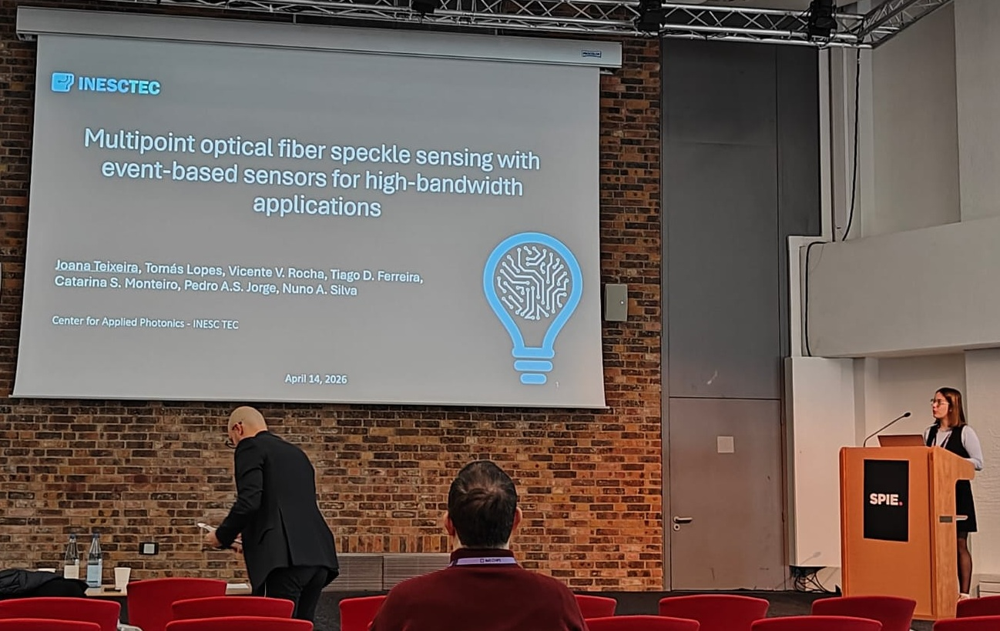
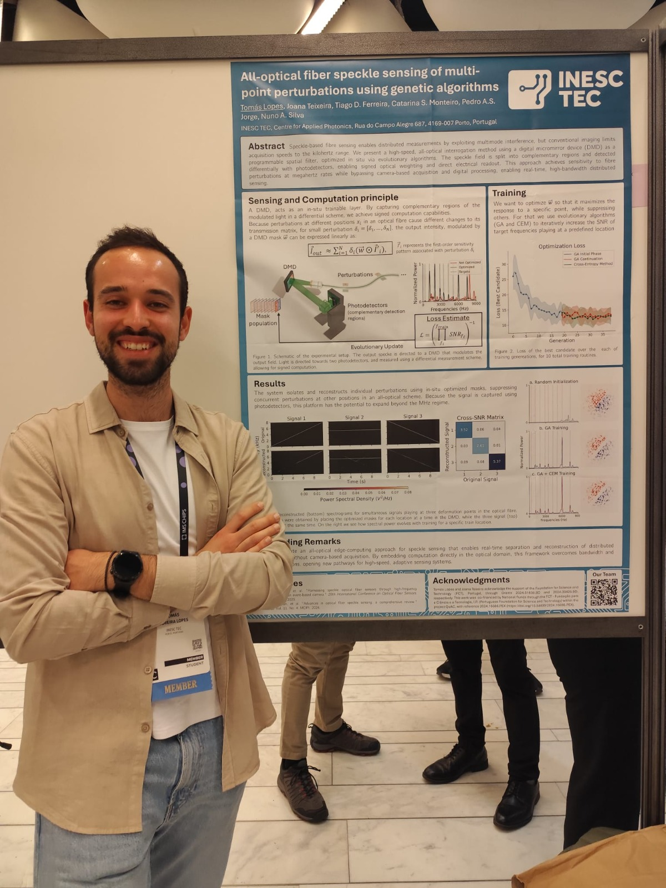
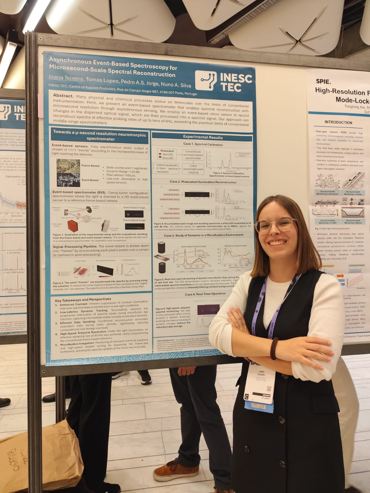

From April 12th to 16th, 2026, QUANTOS team members Joana Teixeira and Tomás Lopes participated in SPIE Photonics Europe, held in Strasbourg, France. Our group contributed actively to the scientific program with an oral presentation and two research posters, showcasing the latest developments in high-speed optical sensing and event-based interrogation technologies.

### Multipoint Optical Fiber Speckle Sensing With Event-Based Sensors For High-Bandwidth Applications (Oral Presentation)

Authors: Joana Teixeira, Tomás Lopes, Catarina S. Monteiro, Tiago D. Ferreira, Pedro A.S. Jorge, Nuno A. Silva

This work introduces an interrogation framework using event-based vision to overcome the frame-rate limits of conventional cameras. By capturing local intensity variations with microsecond resolution, the system enables high-bandwidth, multi-point sensing of speckle dynamics, successfully reconstructing complex signals like audio waveforms along a single fiber. <a href="../../posts/post_2026_04_27/poster_photonics_europe.pdf" target="_blank" rel="noopener">Click here to see the poster</a>

<figure style="display: flex; flex-direction: column; align-items: center; margin: 2rem auto; text-align: center;">
  
  <figcaption style="font-style: italic; font-size: 0.9rem; color: #666; margin-top: 0.5rem;">Figure 1 - Joana Teixeira's oral presentation at SPIE Photonics Europe 2026.</figcaption>
</figure>

### All-Optical Fiber Speckle Sensing Of Perturbations Using Genetic Algorithms (Poster Presentation)

Authors: Tomás Lopes, Joana Teixeira, Tiago D. Ferreira, Catarina S. Monteiro, Pedro A.S. Jorge, Nuno A. Silva

In this work, we presented a high-speed interrogation scheme using a Digital Micromirror Device (DMD) and evolutionary algorithms trained in situ. By replacing imaging sensors with optimized optical filtering, the system can reach the megahertz regime, providing a low-cost, all-optical solution for high-frequency perturbation detection.  <a href="../../posts/post_2026_04_27/poster_photonics_europe_TomasLopes.pdf" target="_blank" rel="noopener">Click here to see the poster</a>

<figure style="display: flex; flex-direction: column; align-items: center; margin: 2rem auto; text-align: center;">
  
  <figcaption style="font-style: italic; font-size: 0.9rem; color: #666; margin-top: 0.5rem;">Figure 2 - Tomás Lopes' poster presentation at SPIE Photonics Europe 2026.</figcaption>
</figure>

### Asynchronous Event-Based Spectroscopy For Microsecond-Scale Spectral Reconstruction (Poster Presentation)

Authors: Joana Teixeira, Tomás Lopes, Pedro A.S. Jorge, Nuno A. Silva

This work proposes an event-based spectrometer for real-time spectral reconstruction with microsecond precision. Capable of detecting signals up to 40 kHz, the system was validated in microfluidic environments, demonstrating its potential for monitoring fast-moving chemical and physical processes where conventional frame-based sensors fail.

<figure style="display: flex; flex-direction: column; align-items: center; margin: 2rem auto; text-align: center;">
  
  <figcaption style="font-style: italic; font-size: 0.9rem; color: #666; margin-top: 0.5rem;">Figure 3 - Joana Teixeira's poster presentation at SPIE Photonics Europe 2026.</figcaption>
</figure>

