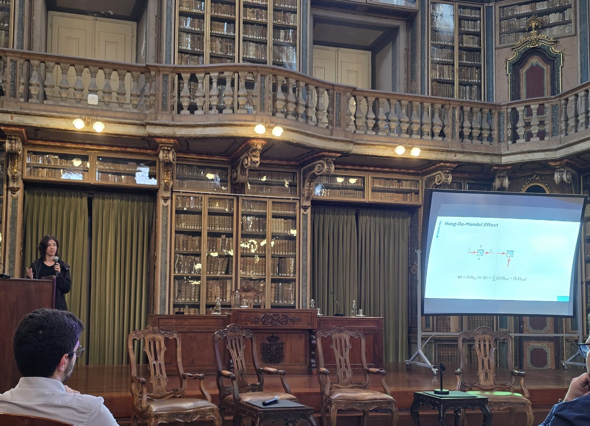

The QUANTOS team was present in the Quantum Day @PT 2026 conference, held at the Academia de Ciências, in Lisbon, Portugal. Following a similar formula as the previous year, this event included talks on the most prominent topics in quantum technology, a discussion panel regarding the current and future situation of quantum sciences in various areas and a student-oriented segment, this year featuring thesis pitch presentations for both MSc and PhD candidates.

It is in this context, QUANTOS contributed to the that pitch presentation session with the results from our work on Hong-Ou-Mandel-based birefringent imaging, which constituted the main output from Carolina’s MSc thesis.

We were able to gauge the current situation on young researchers’ work in quantum technologies and widen horizons on the potential of some techniques and materials. This type of events also give us the chance to create the connections for possible future collaborations on inter-disciplinary projects, among speakers and students alike.

<figure style="display: flex; flex-direction: column; align-items: center; margin: 2rem auto; text-align: center;">
  
  <figcaption style="font-style: italic; font-size: 0.9rem; color: #666; margin-top: 0.5rem;">Figure 1 - Carolina oral poster presentation at Quantum Day @PT 2026 conference.</figcaption>
</figure>

