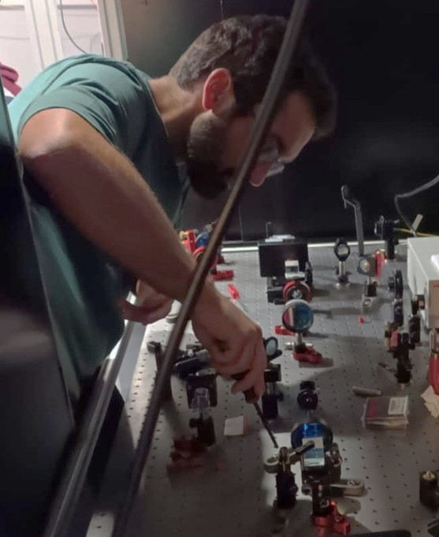
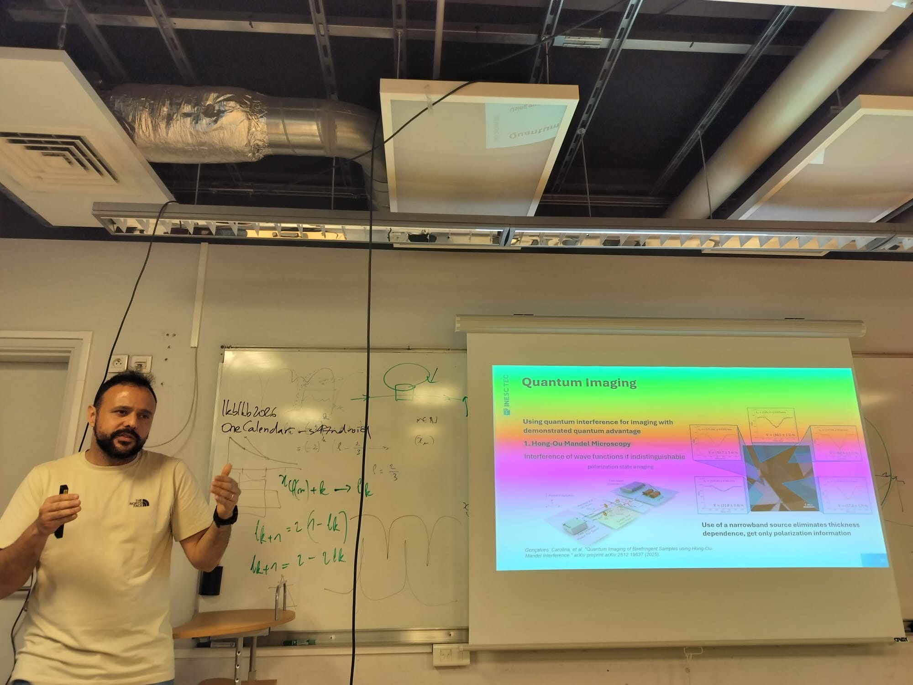
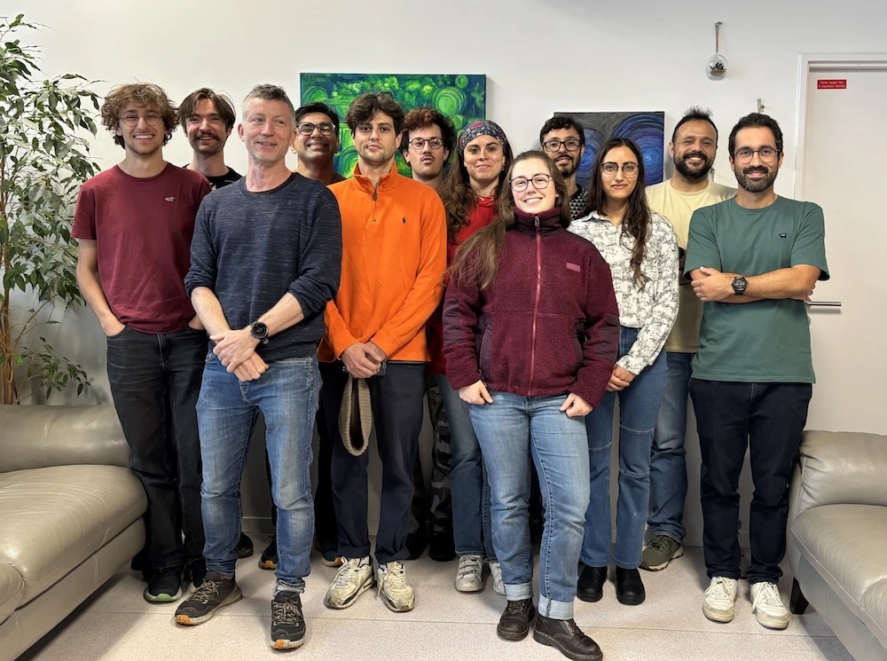

From 18 to 22 May, Tiago Ferreira and Nuno Silva visited the Quantum Fluids of Light group at Laboratoire Kastler Brossel, Sorbonne University. The visit took place in the context of an FCT bilateral project between Portugal and France, with Tiago Ferreira as Principal Investigator for the INESC TEC team and Quentin Glorieux as Principal Investigator for the French team. [Read more about the project](../../projects/NextGenPFL/nextgenpfl_index.html)

The project is a joint effort to advance the next generation of paraxial fluids of light, aiming to overcome the limitations imposed by the finite length of nonlinear optical media. To achieve this, the team is exploring digital methods to artificially extend the effective length of the simulations. In simple terms, the idea is to measure the state at the output of the nonlinear medium and re-inject it at the entrance, allowing it to propagate again and thereby increasing the effective simulation length. Although conceptually simple, this approach is experimentally challenging, particularly because ensuring that the reconstructed state accurately matches the original one is far from trivial.

<figure style="display: flex; flex-direction: column; align-items: center; margin: 2rem auto; text-align: center;">
  
  <figcaption style="font-style: italic; font-size: 0.9rem; color: #666; margin-top: 0.5rem;">Figure 1 - Tiago presentation about the Digital Feedback Loop at LKB.</figcaption>
</figure>

During the visit, the teams discussed future directions for this implementation, its current limitations, and the types of physical dynamics that could be explored using this method. As part of these discussions, Tiago gave a detailed presentation on the current implementation of the digital feedback loop at INESC TEC. Throughout the week, Tiago and Nuno also worked on a simple experimental setup to explore how this approach could be implemented using the nonlinear optical media available at LKB.

<figure style="display: flex; flex-direction: column; align-items: center; margin: 2rem auto; text-align: center;">
  
  <figcaption style="font-style: italic; font-size: 0.9rem; color: #666; margin-top: 0.5rem;">Figure 2 - Setup assembling that Tiago and Nuno explored during their visit.</figcaption>
</figure>

Nuno also gave a talk presenting an overview of the current research lines and recent work developed by the QUANTOS team and INESC TEC more broadly. These discussions opened up new possibilities for future collaborations and further strengthened the partnership between the two teams.

<figure style="display: flex; flex-direction: column; align-items: center; margin: 2rem auto; text-align: center;">
  
  <figcaption style="font-style: italic; font-size: 0.9rem; color: #666; margin-top: 0.5rem;">Figure 3 - Nuno presentation at LKB.</figcaption>
</figure>

We also took a group photo with the quantum fluids of light team at the LKB
<figure style="display: flex; flex-direction: column; align-items: center; margin: 2rem auto; text-align: center;">
  
  <figcaption style="font-style: italic; font-size: 0.9rem; color: #666; margin-top: 0.5rem;">Figure 4 - Group photon with the quantum fluids of light team. Photo taken from the team <a href="(https://www.quentinglorieux.fr)">website</a>.</figcaption>
</figure>

