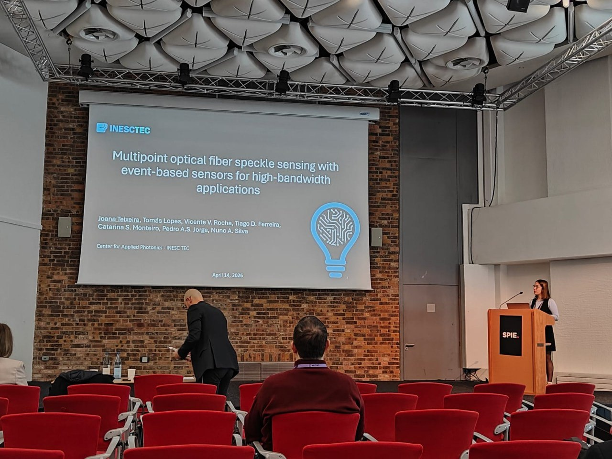

Joana Teixeira received the Best Student Paper Award for the work “Multipoint optical fiber speckle sensing with event-based sensors for high-bandwidth applications” at the Optical Sensing and Detection IX subconference, part of the SPIE Photonics Europe International Symposium, held from 12 to 16 April 2026 in Strasbourg, France.

The award recognises student presentations for their quality, clarity, innovation, and relevance to the scientific field of the conference. The awarded work explores a new approach to multipoint optical fiber sensing using event-based sensors for high-bandwidth applications, and is related to the already published article [“Event-based speckle interrogation for high-bandwidth multi-point optical fiber sensing.”](https://www.sciencedirect.com/science/article/pii/S0924424726005364)

<figure style="display: flex; flex-direction: column; align-items: center; margin: 2rem auto; text-align: center;">
  
  <figcaption style="font-style: italic; font-size: 0.9rem; color: #666; margin-top: 0.5rem;">Figure 1 - Joana presentation at SPIE Photonics Europe International Symposium.</figcaption>
</figure>

