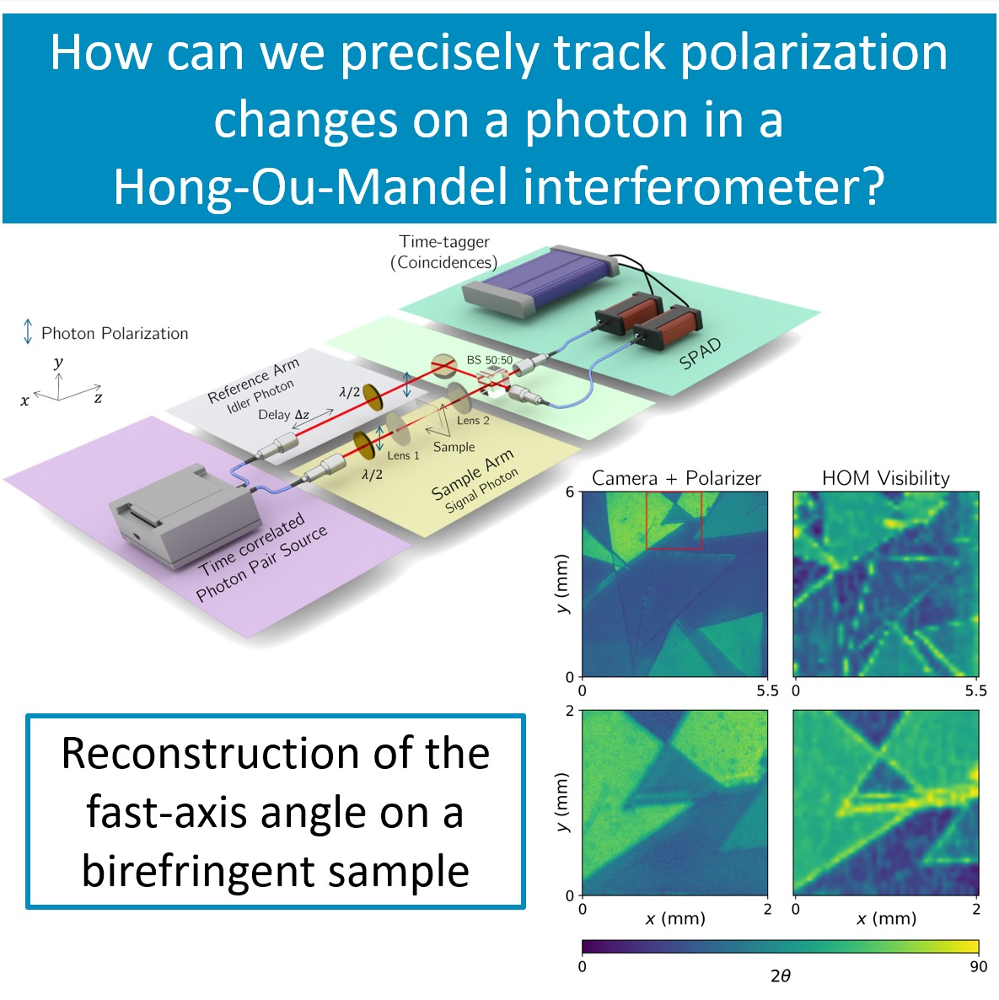

Our first work in the field of quantum optical technologies has been accepted by APL Photonics. The paper will appear in the Invited Articles section and presents our proof-of-concept research on tracking fast-axis orientation using Hong-Ou-Mandel (HOM) interference. Beyond the scientific significance of the results, this system is, to the best of our knowledge, the first quantum microscope developed in Portugal. The work was carried out as part of our PhD student Carolina’s Master’s thesis.

The paper is available online in [APL Photonics](https://doi.org/10.1063/5.0326576)

### Key Highlights:
- Development of a statistical model for HOM-based birefringence imaging, including photon losses and temporal distinguishability;
- Derivation of the Fisher information and a maximum-likelihood estimator for retrieving the local fast-axis orientation from photon-count data;
- Identification of the HOM-dip centre as the optimal operating point for maximum-precision measurements
- Use of a narrowband photon-pair source to broaden the HOM dip, making the measurement largely insensitive to realistic sample-thickness variations;
- Experimental reconstruction of 2D birefringence maps through raster scanning, with results in good agreement with classical polarizer-based imaging;
- Demonstration of enhanced boundary contrast in HOM-visibility maps, linked to additional two-photon distinguishability near sample edges.

<figure style="display: flex; flex-direction: column; align-items: center; margin: 2rem auto; text-align: center;">
  
  <figcaption style="font-style: italic; font-size: 0.9rem; color: #666; margin-top: 0.5rem;">Figure 1 - Graphical Abstract</figcaption>
</figure>