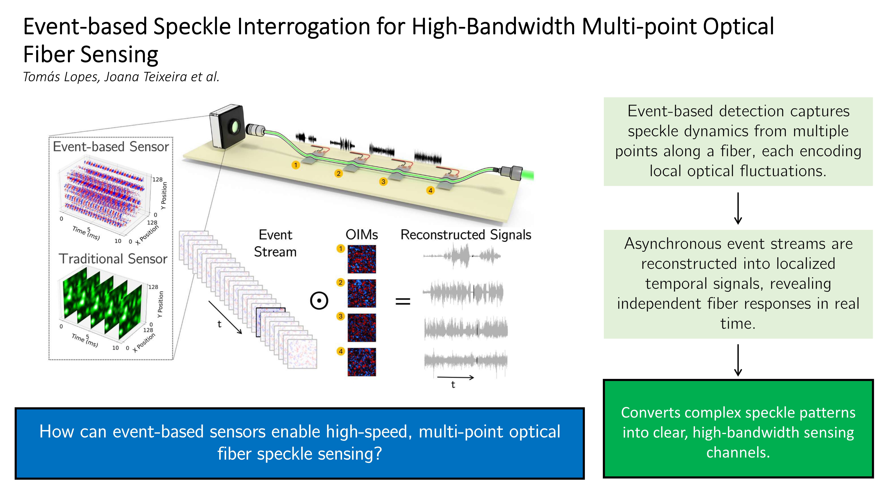

Our latest research, [Event-based speckle interrogation for high-bandwidth multi-point optical fiber sensing](https://www.sciencedirect.com/science/article/pii/S0924424726005364), has been recently published in Sensors and Actuators: A. Physical. The study describes a novel interrogation framework that introduces event-based vision to achieve high throughput, high bandwidth, and low-latency speckle analysis for multi-point fiber optic sensing. 

By leveraging neuromorphic vision sensors alongside machine learning optimization, our approach eliminates standard frame-rate bottlenecks and proves capable of isolating simultaneous dynamic deformations at distinct locations along a single multimode fiber. 

### Key Highlights from the Study:
- **High-Bandwidth Acoustic Reconstruction**: While conventional camera-based speckle interrogation is limited to low frequencies, this event-driven framework successfully reconstructs high-bandwidth acoustic signals up to 20 kHz, covering the full human audible range. 
- **True Multi-Point Separation**: Combining multi-point calibration with a PyTorch-based linear model, the system extracts "optimal interrogation modes" (spatial weighting masks). This setup successfully isolates simultaneous signals from four piezoelectric actuators with minimal crosstalk over varying distances (from 3 cm to 75 cm). 
- **Neuromorphic Data Efficiency**: By utilizing an Event-Based Sensor, that records asynchronous intensity changes rather than absolute values, the data rate scales with physical perturbation instead of pixel count. This dramatically reduces computational load and memory constraints, allowing for real-time signal processing. 
- **Massive Dynamic Range**: The logarithmic pixel response of the EVS yields a dynamic range of up to 120 dB. This entirely prevents the overexposure or saturation of bright speckle grains while still capturing low-intensity fluctuations. 
- **Cost-Effective Alternative**: The setup offers a highly compact, lightweight, and low-cost alternative to traditional distributed acoustic sensing (DAS) architectures, making it versatile for complex, unstructured environments. 

To our knowledge, this is the first demonstration of a multimode fiber speckle sensor capable of the simultaneous detection, reconstruction, and isolation of different signals applied at distinct locations along the fiber. By transforming the inherent complexity of optical speckle patterns into a powerful sensing capability, this framework opens a practical and cost-effective route for next-generation distributed and quasi-distributed fiber sensing.

<figure style="display: flex; flex-direction: column; align-items: center; margin: 2rem auto; text-align: center;">
  
  <figcaption style="font-style: italic; font-size: 0.9rem; color: #666; margin-top: 0.5rem;">Figure 1 - Graphical Abstract</figcaption>
</figure>