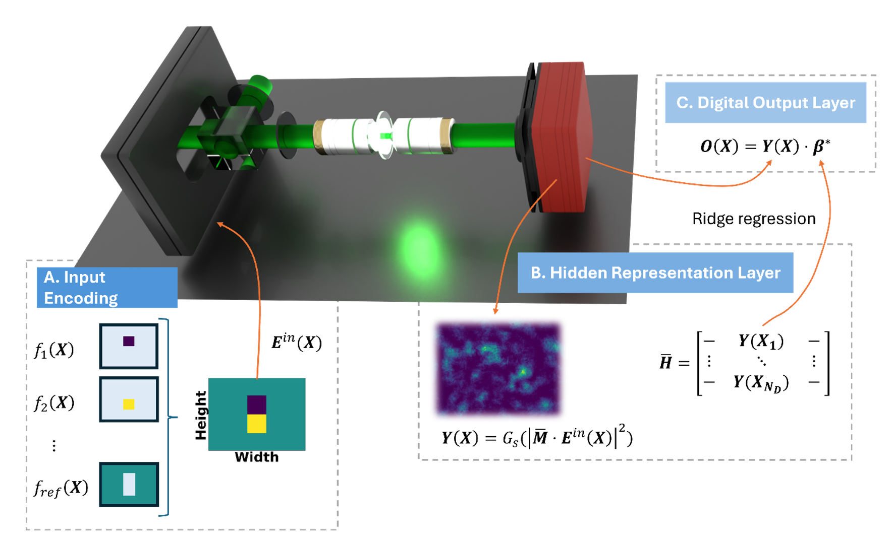

Our latest research, Probing a theoretical framework for a photonic extreme learning machine, has been published in [New Journal of Physics](https://iopscience.iop.org/article/10.1088/1367-2630/ae51b5). The study develops a theoretical framework for Photonic Extreme Learning Machines (PELMs), clarifying how optical components can be connected to the mathematical requirements of the Extreme Learning Machine (ELM) paradigm. In short, ELMs have two requirements for universal function approximation with the first being randomly initialized weights and biases while the second is non-polynomial activation functions.

By modelling the optical system stage by stage – input encoding and random light propagation to camera detection and digital readout – the work provides a clearer understanding of the capabilities and limitations of this optical neuromorphic approach.

### Key Highlights from the Study:
- **The first pillar of ELM computing**: Our model of random propagation through a diffusive medium described using a transmission matrix formalism, allows the optical scattering process to be interpreted as a random linear layer. Additionally, when a constant reference signal is used to interfere the random transmission maps the input to a random bias. Therefore, the propagation through a diffusive medium provides the physical analogue of the first requirement of ELM.
- **The second pillar of ELM**: The work highlights the detection stage as source of nonlinear activation comprised of coherent interferometric process and camera response function. We show that under linear camera response the activation function is a second-order polynomial and is therefore limited with the dimensionality upper bounded by a combinatorial relation of the input modes. 
- **Dimensionality estimation**: To evaluate the hidden-space dimensionality we employ a noise-robust dimensionality estimation based on singular value decomposition and Weyl’s inequality. This approach makes it possible to distinguish meaningful dimensions from features induced by noise.
- **Experimental validation**: Experiments validate the theoretical model by allowing the estimation of the dimensionality in low-dimensional input regimes with nearly linear camera response. By raising the exposure, we operate the camera in a nonlinear saturation response with the observable effect of hidden layer dimensionality and expressive capability growth, achieving improved task performance.

Overall, this work provides a quantitative bridge between coherent optical propagation and the theory of Extreme Learning Machines. By clarifying how optical encoding, random scattering, detection nonlinearity and dimensionality determine the computing capabilities of PELMs, the study opens new directions for the development of robust optical computing hardware.

<figure style="display: flex; flex-direction: column; align-items: center; margin: 2rem auto; text-align: center;">
  
  <figcaption style="font-style: italic; font-size: 0.9rem; color: #666; margin-top: 0.5rem;">Figure 1 - Overview of the photonic extreme learning machine framework. Input information is encoded onto an optical beam, randomly mixed through propagation through a diffusive medium, detected as a speckle pattern by a camera, and finally processed through a digital linear readout.</figcaption>
</figure>