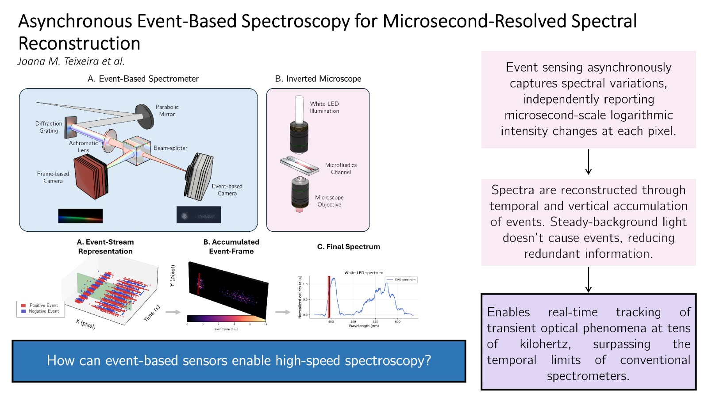

Our team's latest research, "Asynchronous event-based spectroscopy for microsecond-resolved spectral reconstruction," has been recently published in [Sensors and Actuators: A. Physical](https://www.sciencedirect.com/science/article/pii/S0924424726007351). 

The study addresses the fundamental constraints of conventional frame-based spectrometers, which are frequently limited to kilohertz-regime acquisition speeds and struggle with fast-evolving physical and chemical processes.  To circumvent these limitations, our researchers developed a custom event-based spectrometer utilizing a Czerny-Turner configuration combined with asynchronous, event-driven sensing. This innovative approach translates streams of binary events into calibrated spectra, unlocking microsecond-scale temporal resolution for dynamic spectral measurements.

### Key Highlights from the Study:

 - **Temporal Resolution**: The event-based spectrometer is capable of reconstructing spectra at probing rates up to tens of kilohertz. During high-frequency testing, the system successfully achieved effective spectral probing rates of 60 kHz and 80 kHz, far exceeding the practical limits of conventional mid-range frame-based spectrometers.
 - **Data Efficiency**: Because the event-based camera operates asynchronously, individual pixels only report logarithmic intensity changes that exceed a predefined threshold. This inherent suppression of constant illumination bypasses typical saturation limits and heavily reduces computational load, as data is only generated and processed when true optical variations occur.  
 - **Dedicated Signal Processing Pipeline**: To extract usable spectra from raw data, we developed a specialized processing pipeline. This includes temporal accumulation, geometric tilt correction, and the vertical spatial integration of the spectral line, which collectively enhance the signal-to-noise ratio.  
 - **Visible Range Coverage**: Through calibration and optical alignment, the current system successfully covers a 233.7 nm bandwidth within the visible range (from 414.47 nm to 648.21 nm). It features an estimated spectral dispersion of approximately 0.18 nm per pixel.  
 - **Real-Time Microfluidic Validation**: The spectrometer's practical capabilities were demonstrated using a microfluidic channel integrated into an inverted microscope. The event-based setup successfully tracked transient spectral changes, induced by the introduction of an absorbing red dye, with significantly higher temporal fidelity and resolution than the conventional frame-based approach. 

<figure style="display: flex; flex-direction: column; align-items: center; margin: 2rem auto; text-align: center;">
  
  <figcaption style="font-style: italic; font-size: 0.9rem; color: #666; margin-top: 0.5rem;">Figure 1 - Graphical abstract.</figcaption>
</figure>