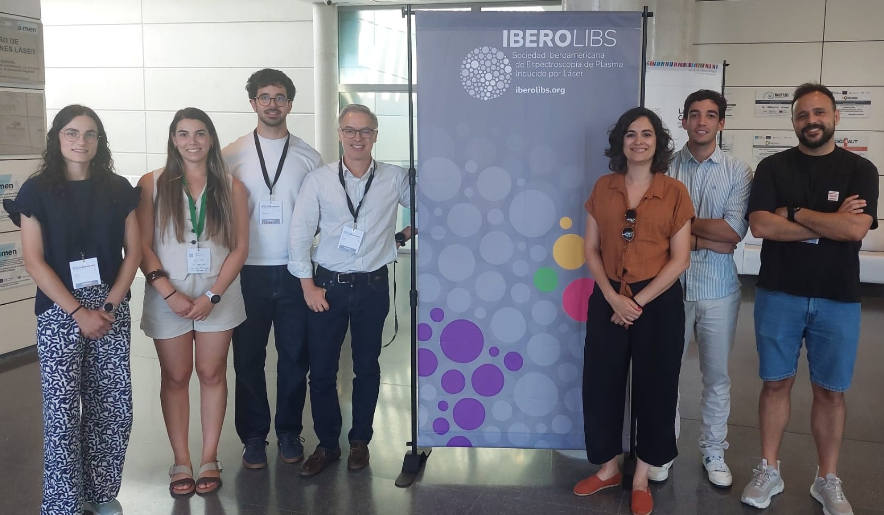
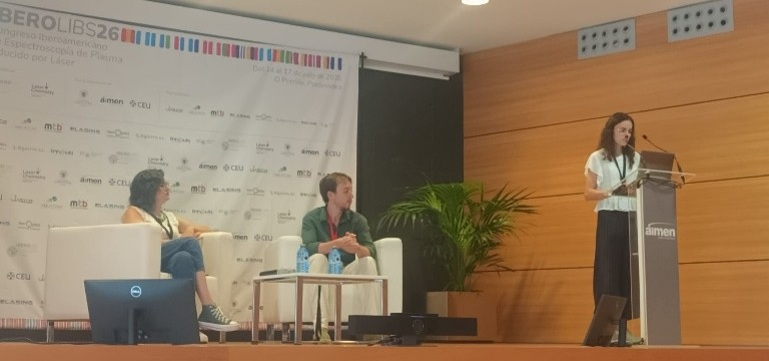
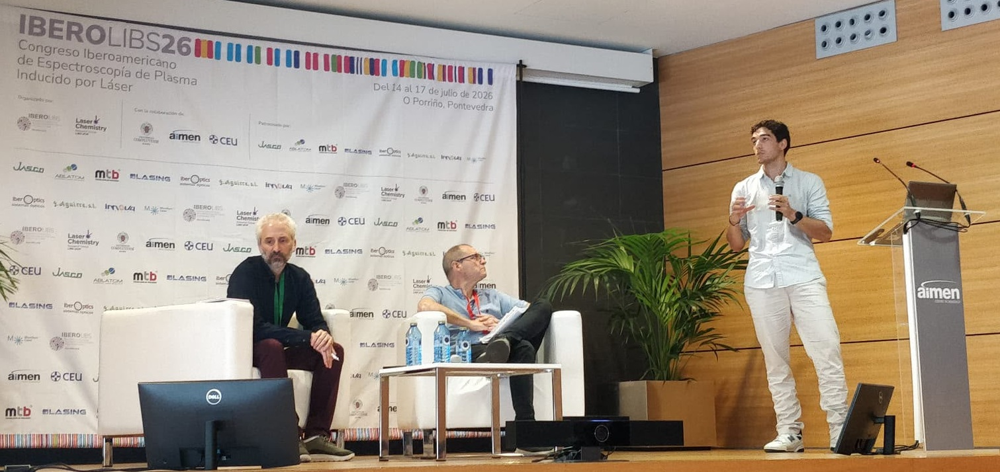
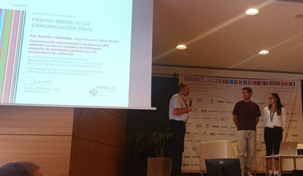
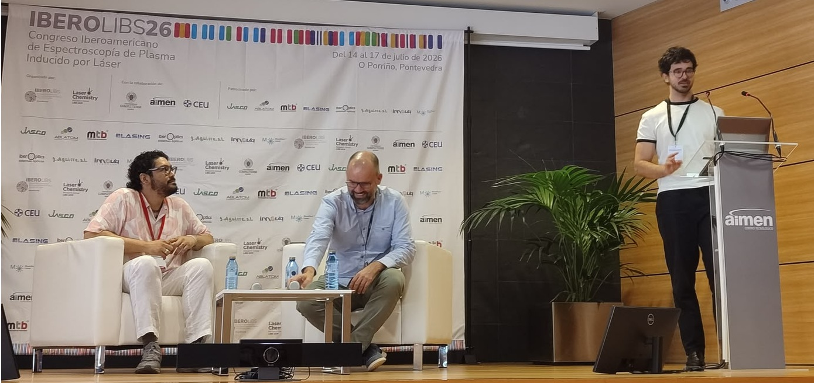
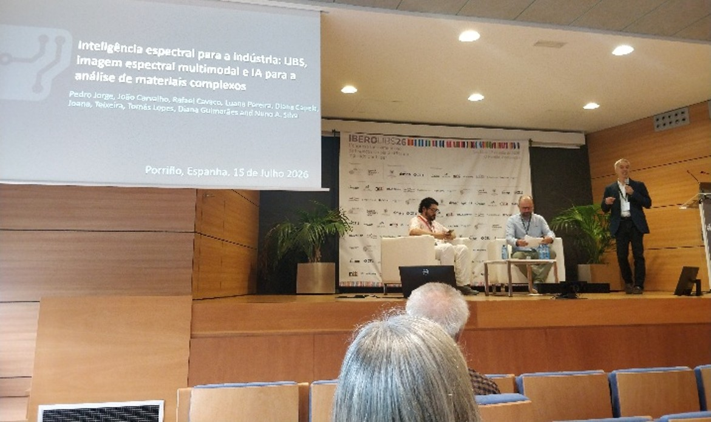
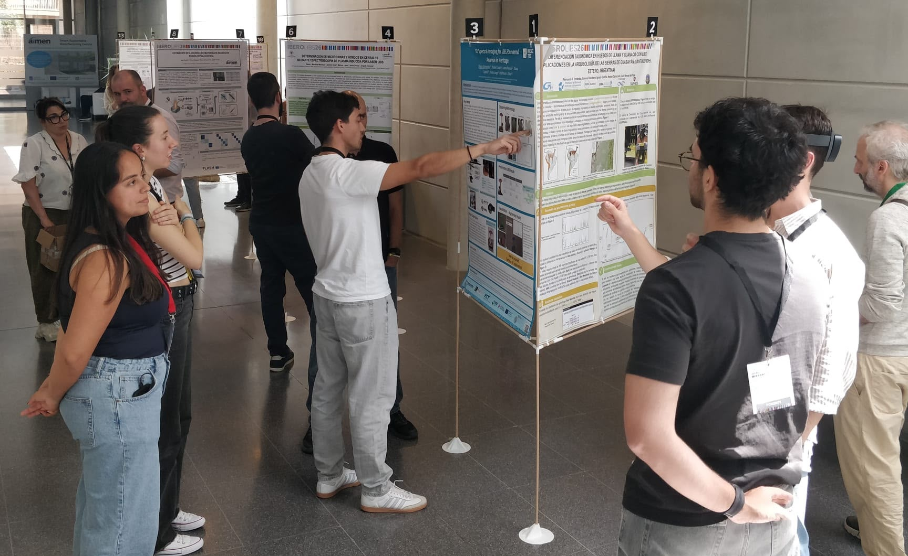
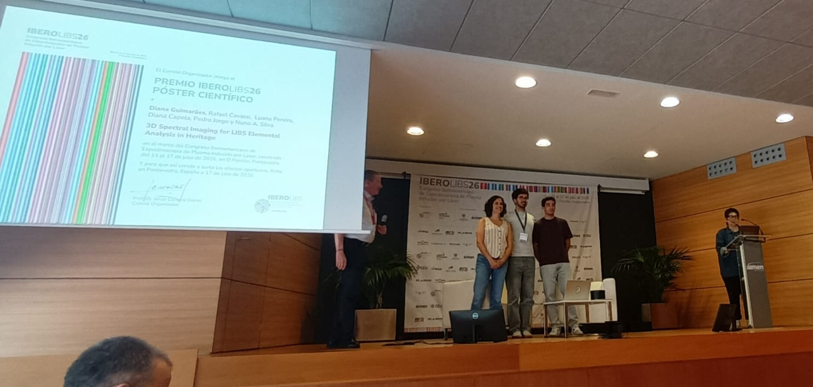
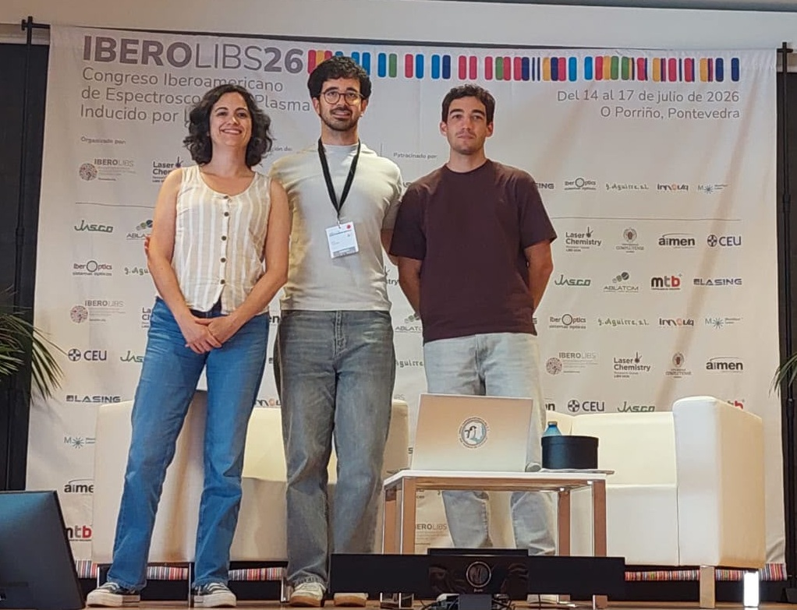

From 14 to 17 July 2026, members of the QUANTOS research team participated in the 1st IBEROLIBS International Scientific Congress, held in O Porriño, in the Vigo area of Galicia, Spain. The conference brought together researchers, professionals and students from the Ibero-American LIBS community to discuss recent scientific advances and applications of Laser-Induced Breakdown Spectroscopy (LIBS).

QUANTOS was represented by Rafael Cavaco, João Carvalho, Diana Capela, Pedro Jorge, Diana Guimarães and Nuno Silva. The team contributed to the scientific program with four oral communications and one poster presentation.
<figure style="display: flex; flex-direction: column; align-items: center; margin: 2rem auto; text-align: center;">
  
  <figcaption style="font-style: italic; font-size: 0.9rem; color: #666; margin-top: 0.5rem;">Figure 1 - Team photon at IBEROLIBS26.</figcaption>
</figure>

The team’s participation was further distinguished with two awards. Rafael Cavaco received the Best Oral Presentation Award, while Diana Guimarães received the Best Poster Award. It is also worth noting that Pedro Jorge and Diana Guimarães are founding members of the IBEROLIBS Society and contributed to the establishment of this new scientific community.
These distinctions recognize the scientific quality and relevance of the research developed by the team in LIBS, spectral imaging, artificial intelligence and multimodal data analysis. 

### Multimodal Knowledge Distillation for Mining Applications (Oral Presentation)

Diana Capela presented a machine-learning approach based on knowledge distillation for the analysis of multimodal data in mining applications. The work explored how information from different sensing modalities can be combined to improve material classification while reducing the complexity of the final predictive model.

<figure style="display: flex; flex-direction: column; align-items: center; margin: 2rem auto; text-align: center;">
  
  <figcaption style="font-style: italic; font-size: 0.9rem; color: #666; margin-top: 0.5rem;">Figure 2 - Diana Capela oral presentation.</figcaption>
</figure>

### Hyperspectral Imaging-Guided LIBS Using a Home-Built Galvanometric Point-Scanning System (Oral Presentation)

Rafael Cavaco presented a methodology that combines hyperspectral imaging with Laser-Induced Breakdown Spectroscopy (LIBS). Hyperspectral data was used to identify regions with different spectral characteristics and guide the selection of representative points for subsequent elemental analysis by LIBS. This presentation won the Best Oral Communication Award.

<figure style="display: flex; flex-direction: column; align-items: center; margin: 2rem auto; text-align: center;">
  
  <figcaption style="font-style: italic; font-size: 0.9rem; color: #666; margin-top: 0.5rem;">Figure 3 - Rafael Cavaco oral presentation.</figcaption>
</figure>

<figure style="display: flex; flex-direction: column; align-items: center; margin: 2rem auto; text-align: center;">
  
  <figcaption style="font-style: italic; font-size: 0.9rem; color: #666; margin-top: 0.5rem;">Figure 4 - Oral Communication Award.</figcaption>
</figure>

### Automated 3D Image Registration for LIBS Applications (Oral Presentation)

João Carvalho presented an automated image-registration approach for integrating LIBS measurements with three-dimensional models. The work addressed the spatial alignment of elemental information with the corresponding positions on the object’s surface, enabling the visualization  and analysis of LIBS data in a 3D context.

<figure style="display: flex; flex-direction: column; align-items: center; margin: 2rem auto; text-align: center;">
  
  <figcaption style="font-style: italic; font-size: 0.9rem; color: #666; margin-top: 0.5rem;">Figure 5 - João Carvalho oral presentation.</figcaption>
</figure>

### Inteligencia espectral para la industria: LIBS, imágenes multimodales e IA para el análisis de materiales complejos (Oral Presentation)

Pedro A. S. Jorge delivered a plenary lecture on the use of spectral intelligence for industrial applications. The presentation highlighted the combined use of LIBS, multimodal imaging, and artificial intelligence for the characterization and analysis of complex materials.

<figure style="display: flex; flex-direction: column; align-items: center; margin: 2rem auto; text-align: center;">
  
  <figcaption style="font-style: italic; font-size: 0.9rem; color: #666; margin-top: 0.5rem;">Figure 6 - Pedro Jorge oral presentation.</figcaption>
</figure>

### 3D Spectral Imaging for LIBS Elemental Analysis in Heritage (Poster Presentation)

Diana Guimarães presented a poster on the integration of spectral imaging, LIBS elemental analysis, and three-dimensional models for heritage applications. The work explored how chemical and spectral information can be mapped onto the surface of cultural heritage objects, supporting their non-invasive study and visualization. This poster received the Best Poster Presentation Award. <a href="../../posts/post_2026_07_27/Poster_Diana_Guimarães_IBEROLIBS_F.pdf" target="_blank" rel="noopener">Click here to see the poster. </a>

<figure style="display: flex; flex-direction: column; align-items: center; margin: 2rem auto; text-align: center;">
  
  <figcaption style="font-style: italic; font-size: 0.9rem; color: #666; margin-top: 0.5rem;">Figure 7 - Poster presentation.</figcaption>
</figure>

<figure style="display: flex; flex-direction: column; align-items: center; margin: 2rem auto; text-align: center;">
  
  <figcaption style="font-style: italic; font-size: 0.9rem; color: #666; margin-top: 0.5rem;">Figure 8 - Poster Award photo.</figcaption>
</figure>

<figure style="display: flex; flex-direction: column; align-items: center; margin: 2rem auto; text-align: center;">
  
  <figcaption style="font-style: italic; font-size: 0.9rem; color: #666; margin-top: 0.5rem;">Figure 9 - Team members that won the Best Poster Award.</figcaption>
</figure>

