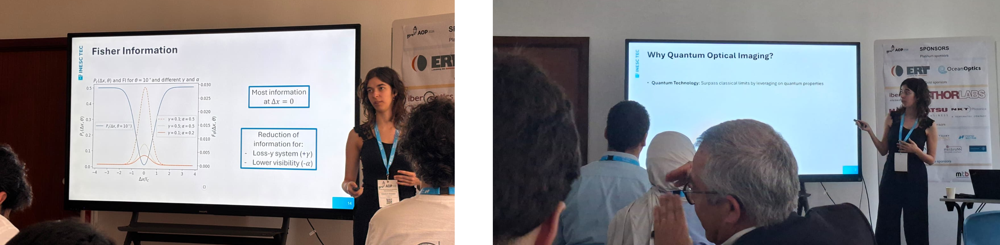
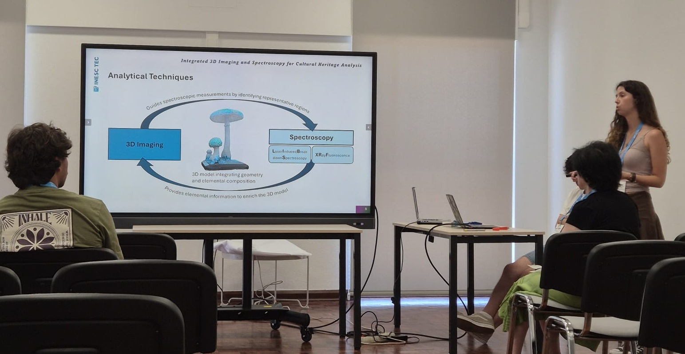
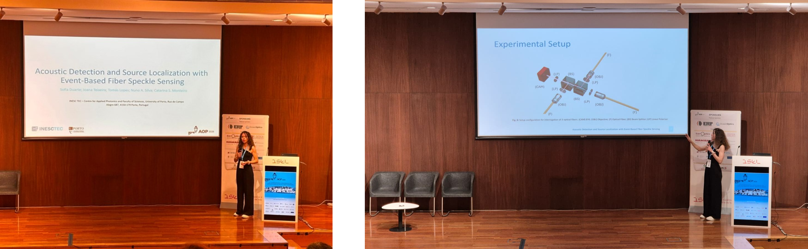

From July 7th to 10th, Carolina Gonçalves, Luana Pereira and Sofia Duarte from QUANTOS participated in the 7th International Conference on Applications of Optics and Photonics (AOP 2026), held in Lisbon, Portugal. Our group contributed actively to the scientific program with three oral presentations, showcasing the latest developments in very diverse fields of optics, namely quantum optical sensing and imaging, 3D imaging and spectroscopy methods applied to cultural heritage analysis and speckle-based fiber speckle sensing. 

### Quantum-based Polarization Imaging: from Quantum to Nonlinear Interference

#### Authors: <u>Carolina R. Gonçalves</u>, Tiago D. Ferreira, Catarina S. Monteiro, Nuno A. Silva

This work covers the potential of two quantum optical techniques to perform polarization measurements. By presenting the results from her MSc thesis, Carolina demonstrated the accurate reconstruction of a birefringent sample through Hong-Ou-Mandel imaging while identifying its very low throughput nature. Delving into the newly developed setup to perform imaging with undetected photons, it was shown that this technique too is sensitive to polarization changes, and even proves to be a very powerful solution for two problems: it can image in real time into a commercial CCD and allows a tunable probing wavelength different from the imaging wavelength which will be useful to perform infrared imaging without the troublesome infrared sources and detectors.

<figure style="display: flex; flex-direction: column; align-items: center; margin: 2rem auto; text-align: center;">
  
  <figcaption style="font-style: italic; font-size: 0.9rem; color: #666; margin-top: 0.5rem;">Figure 1 - Carolina Gonçalves's oral presentation at AOP 2026.</figcaption>
</figure>

### Integrated 3D Imaging and Spectroscopy for Cultural Heritage Analysis 

#### Authors: <u>Luana R. Pereira</u>, Rafael Cavaco, Diana Capela, Ana Freitas, Cristiana Vieira, Pedro Jorge, Nuno A. Silva, Diana Guimarães 

In this presentation, Luana introduced part of the work developed during her MSc thesis, focused on the application of a methodology that symbiotically combines 3D imaging and spectroscopy for the analysis of cultural heritage objects. The proposed workflow uses 3D imaging to create a digital model of the object and segment it into colour-based clusters, guiding the acquisition of LIBS measurements together with complementary techniques such as X-ray fluorescence. This strategy maximises the information obtained while minimising the number of analytical measurements required, thereby reducing damage to the object and increasing the efficiency of the analytical process. Finally, an augmented reality application is proposed, in which the chemical distribution of the analysed object is projected directly onto its 3D model, providing an intuitive and interactive platform for the visualisation and interpretation of the analytical results. 

<figure style="display: flex; flex-direction: column; align-items: center; margin: 2rem auto; text-align: center;">
  
  <figcaption style="font-style: italic; font-size: 0.9rem; color: #666; margin-top: 0.5rem;">Figure 2 - Luana Pereira's oral presentation at AOP 2026.</figcaption>
</figure>

### Acoustic Detection and Source Localization with Event-Based Fiber Speckle Sensing  

#### Authors: <u>Sofia Duarte</u>, Joana Teixeira, Tomás Lopes, Nuno A. Silva, Catarina S. Monteiro

The aim of this work was to develop a multimode optical fiber acoustic sensor based on speckle analysis interrogated with an event-based vision sensor. The proposed approach, explored in Sofia’s master’s thesis, enables real-time acoustic detection with high temporal resolution while reducing redundant data compared to conventional camera-based systems. Underwater experiments demonstrated successful detection of acoustic signals emitted by an acoustic modem at distances of up to 3 m. As a proof of concept, the sensing system was also evaluated for surface impact localization, achieving promising results. It was also briefly discussed the potential for acoustic source classification based on polarization studies and the multimodality between classification and localization tasks.

<figure style="display: flex; flex-direction: column; align-items: center; margin: 2rem auto; text-align: center;">
  
  <figcaption style="font-style: italic; font-size: 0.9rem; color: #666; margin-top: 0.5rem;">Figure 3 - Sofia Duarte's oral presentation at AOP 2026.</figcaption>
</figure>
