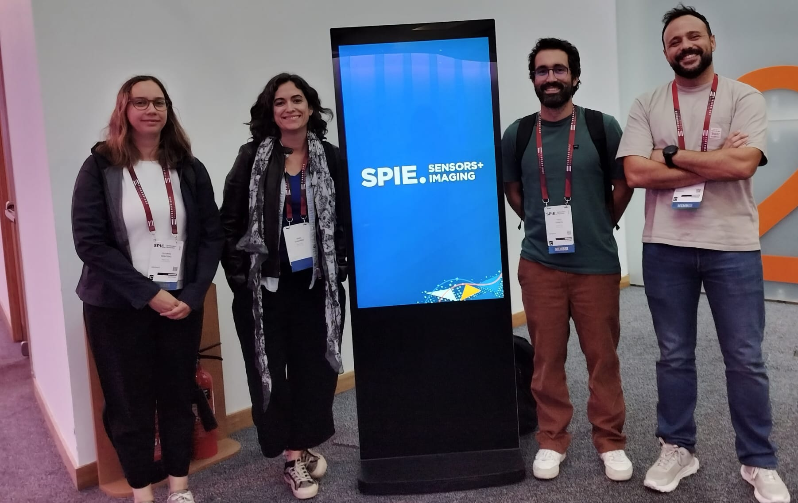
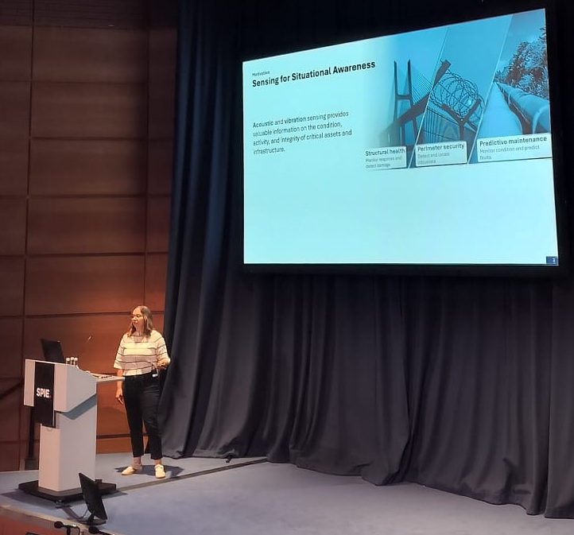
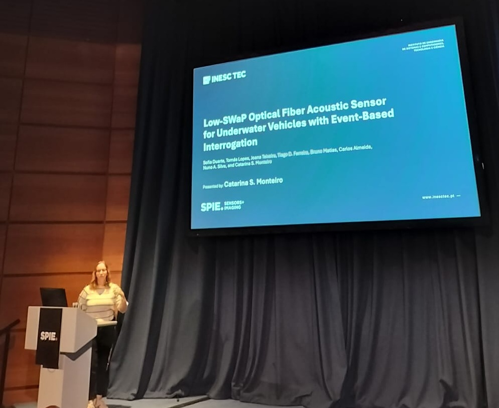
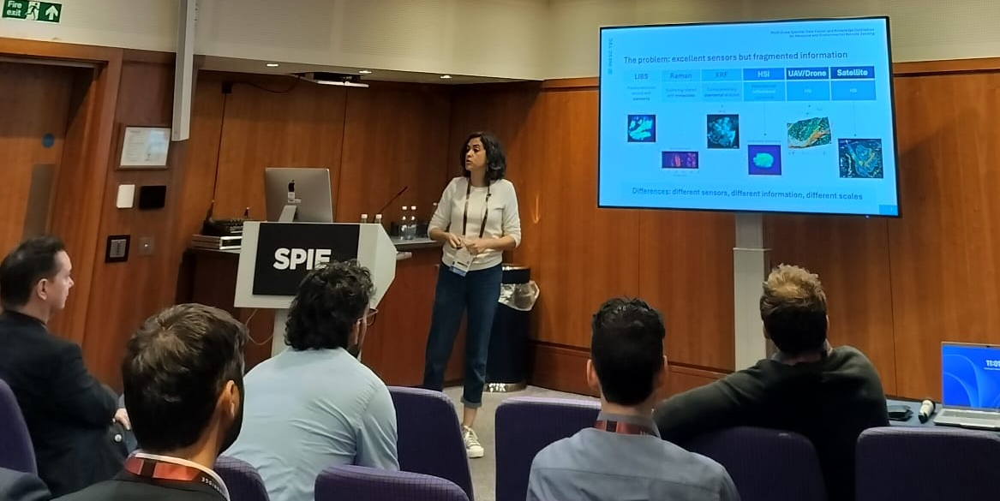
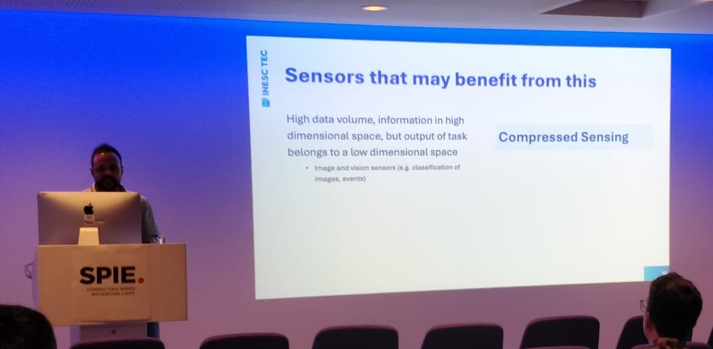
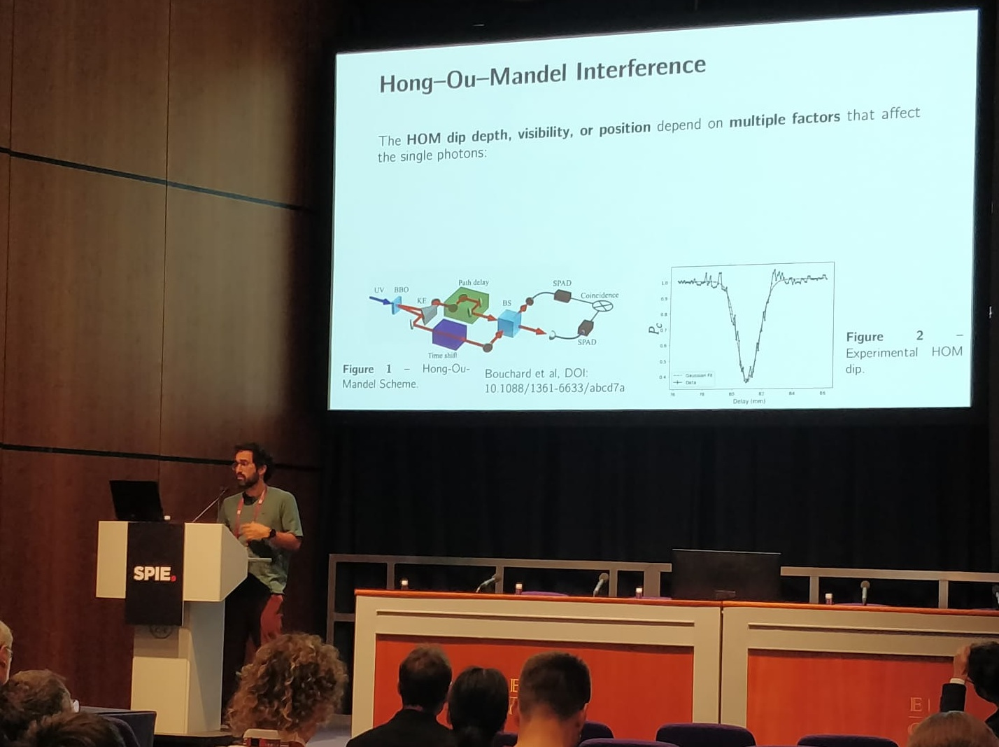

From 14 to 17 September 2026, members of the QUANTOS research team participated in the SPIE Sensors + Imaging 2026, held in Edinburgh, Scotland. The conference brought together researchers and professionals working across sensing, imaging and photonics to share recent advances in the field. Topics ranged from remote sensing and environmental monitoring to security and defence applications.

QUANTOS was represented by Catarina Monteiro, Diana Guimarães, Nuno Silva and Tiago Ferreira. The team contributed to the scientific programme with five oral presentations, including one invited talk.

<figure style="display: flex; flex-direction: column; align-items: center; margin: 2rem auto; text-align: center;">
  
  <figcaption style="font-style: italic; font-size: 0.9rem; color: #666; margin-top: 0.5rem;">Figure 1 - Team photo at SPIE Sensors + Imaging 2026.</figcaption>
</figure>

### Multipoint fiber-optic sensing via sensor fusion of speckle and polarization interrogation (Invited Paper)

Catarina presented a multimodal fiber-optic sensing approach combining speckle dynamics and polarization measurements for spatially resolved acoustic sensing. The work explored how the two sensing modalities can complement each other to simultaneously localize perturbations along the fiber and reconstruct broadband vibration signals, achieving high localization accuracy and waveform reconstruction from 100 Hz to 40 kHz.

<figure style="display: flex; flex-direction: column; align-items: center; margin: 2rem auto; text-align: center;">
  
  <figcaption style="font-style: italic; font-size: 0.9rem; color: #666; margin-top: 0.5rem;">Figure 2 - Catarina Monteiro invited oral presentation.</figcaption>
</figure>

### Low-SWaP optical fiber acoustic sensor for underwater vehicles with event-based interrogation

Catarina also presented an event-based fiber-optic sensing approach for underwater acoustic detection using speckle dynamics in multimode fibers. The work explored how event-based interrogation can reduce data throughput while maintaining high sensing rates, with preliminary results demonstrating acoustic detection from 1 Hz to 20 kHz and successful validation under water tank conditions.

<figure style="display: flex; flex-direction: column; align-items: center; margin: 2rem auto; text-align: center;">
  
  <figcaption style="font-style: italic; font-size: 0.9rem; color: #666; margin-top: 0.5rem;">Figure 3 - Catarina Monteiro second oral presentation.</figcaption>
</figure>

### Multi-scale spectral data fusion and knowledge distillation for resource and environmental remote sensing

Diana Guimarães presented data-fusion and knowledge-distillation approaches for combining complementary information from different spectral sensing modalities and observation scales. Using mineral identification as a case study, the work showed how knowledge transferred from LIBS can improve hyperspectral imaging classification, supporting applications such as mineral mapping, lithological discrimination and resource characterization.

<figure style="display: flex; flex-direction: column; align-items: center; margin: 2rem auto; text-align: center;">
  
  <figcaption style="font-style: italic; font-size: 0.9rem; color: #666; margin-top: 0.5rem;">Figure 4 - Diana Guimarães oral presentation.</figcaption>
</figure>

### Evolutionary and reinforcement learning strategies for all-optical speckle sensing interrogation

Nuno Silva presented an all-optical edge-computing approach for speckle-based sensing, where the relevant information is processed directly in the optical domain rather than through full camera acquisition and digital reconstruction. The work demonstrated real-time separation of simultaneous perturbations in multimode fibers using reconfigurable optical masks, enabling faster and lower-latency sensing limited mainly by photodetector performance.

<figure style="display: flex; flex-direction: column; align-items: center; margin: 2rem auto; text-align: center;">
  
  <figcaption style="font-style: italic; font-size: 0.9rem; color: #666; margin-top: 0.5rem;">Figure 5 - Nuno Silva oral presentation.</figcaption>
</figure>

### Polarization-sensitive Hong-Ou-Mandel microscopy for birefringence imaging using narrowband photon pairs

Tiago Ferreira presented a polarization-sensitive Hong-Ou-Mandel microscopy approach for birefringence imaging. The work explored how quantum interference measurements can be used to recover the local fast-axis orientation of birefringent samples, with preliminary results showing good agreement with classical polarized-intensity imaging and potential for low-light characterization of polarization-sensitive materials and devices.

<figure style="display: flex; flex-direction: column; align-items: center; margin: 2rem auto; text-align: center;">
  
  <figcaption style="font-style: italic; font-size: 0.9rem; color: #666; margin-top: 0.5rem;">Figure 6 -Tiago Ferreira oral presentation.</figcaption>
</figure>