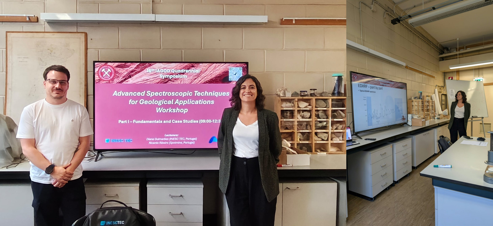
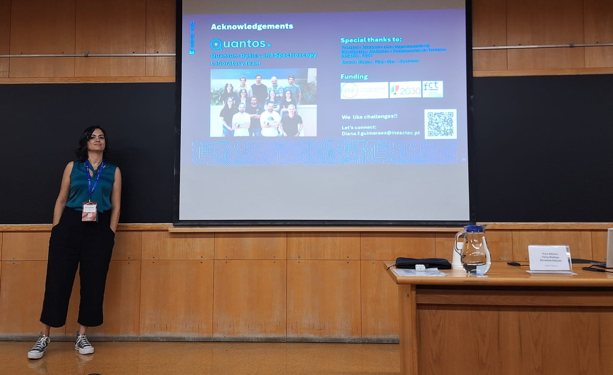
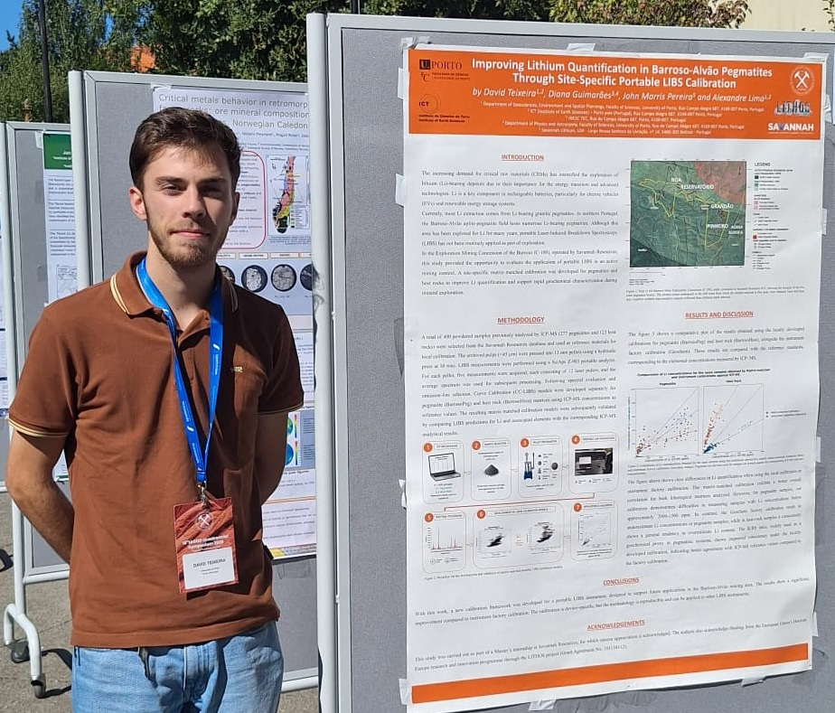

From August 30th to September 2nd, 2026, researchers from QUANTOS participated in the 16th IAGOD Quadrennial Symposium, held at the Faculty of Sciences of the University of Porto. Organised by the International Association on the Genesis of Ore Deposits (IAGOD), this quadrennial symposium is a major international meeting in the field of ore deposits, mineral resources and exploration, bringing together researchers, industry representatives and geoscience professionals from around the world. The 2026 edition, dedicated to “The Role of Geoscience in the Energy Transition”, gathered more than 500 participants and included scientific sessions, plenary and invited lectures, workshops, field trips and technical activities.

As part of the scientific programme, Diana Guimarães (QUANTOS, INESC TEC) and Ricardo Ribeiro (Spotmine) delivered the workshop “Advanced Spectroscopic Techniques for Geological Applications”. The workshop combined a morning session focused on the fundamentals and geological applications of Laser-Induced Breakdown Spectroscopy (LIBS), X-ray Fluorescence (XRF), Raman spectroscopy and Hyperspectral Imaging (HSI) with an afternoon hands-on session, where participants explored the different analytical techniques on geological samples. 
<figure style="display: flex; flex-direction: column; align-items: center; margin: 2rem auto; text-align: center;">
  
  <figcaption style="font-style: italic; font-size: 0.9rem; color: #666; margin-top: 0.5rem;">Figure 1 - Advanced Spectroscopic Techniques for Geological Applications workshop given by Diana Guimarães and Ricardo Ribeiro.</figcaption>
</figure>

Diana Guimarães also contributed with the oral presentation “Towards Smart Mining with Multimodal Spectroscopy for Geological Applications”, presenting recent QUANTOS developments in combining complementary spectroscopic and imaging techniques with machine learning and augmented reality visualisation towards more integrated and decision-oriented approaches for geological exploration and smart mining. 
<figure style="display: flex; flex-direction: column; align-items: center; margin: 2rem auto; text-align: center;">
  
  <figcaption style="font-style: italic; font-size: 0.9rem; color: #666; margin-top: 0.5rem;">Figure 2 - Diana Guimarães oral presentation.</figcaption>
</figure>

The scientific programme also included the work “Improving Lithium Quantification in Barroso-Alvão Pegmatites Through Site-Specific Portable LISB Calibration”, presented by David Teixeira and developed under the supervision of Diana Guimarães, in collaboration with Alexandre Lima. The study focused on local calibration strategies for portable LIBS applied to Li-bearing pegmatites from the Barroso-Alvão region, using ICP-MS measurements as reference data. 
<figure style="display: flex; flex-direction: column; align-items: center; margin: 2rem auto; text-align: center;">
  
  <figcaption style="font-style: italic; font-size: 0.9rem; color: #666; margin-top: 0.5rem;">Figure 3 - David Teixeira poster presentation.</figcaption>
</figure>

The participation provided an important opportunity to disseminate QUANTOS research in spectroscopy, multimodal sensing and spectral imaging within a highly relevant international forum, while strengthening interaction with the geoscience, mineral exploration and mining communities.

