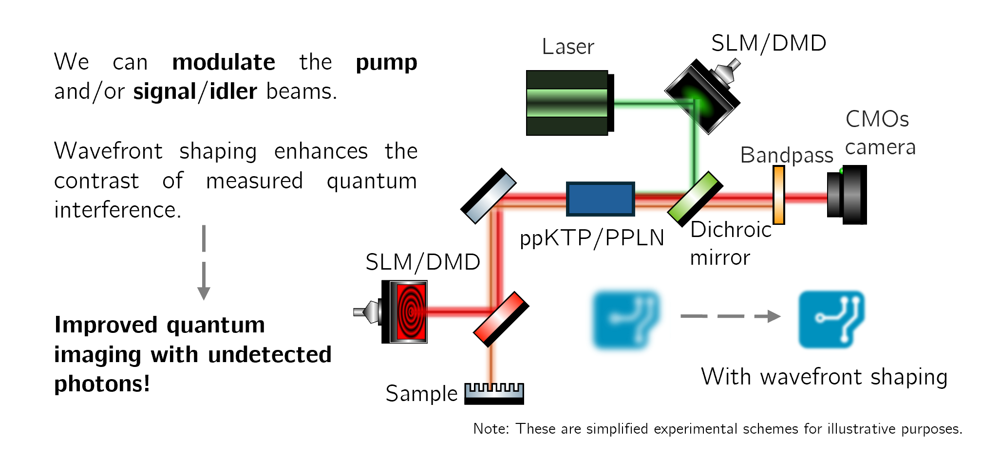

# Project Summary

HyperQuIm aims to be a pioneering step in Portuguese-driven quantum imaging technologies, offering a high-risk, high-reward approach to hyperspectral imaging using quantum principles. We will leverage Imaging with Undetected Photons (IUP) to probe infrared (IR) samples by imaging their visible counterparts through nonlinear interferometry and spontaneous parametric down-conversion (SPDC) inside nonlinear crystals. While IUP is not entirely new, existing setups are bulky and face challenges such as mode matching, optical alignment, and wavelength control.

This project seeks to push beyond the state of the art by integrating wavefront shaping and adaptive optics, creating a scalable, compact, and cost-effective imaging platform capable of functioning outside laboratory conditions. On the technological front, our close collaboration with spectral imaging experts will enable the first real-world application of IUP for sample classification, supported by advanced machine and deep learning tools.

In recent years, hyperspectral imaging has rapidly expanded, finding applications across scientific and industrial fields, from medicine to recycling and raw materials. A key driver of this growth is the ability to access information in the infrared (IR) spectral region (near-IR, shortwave-IR (SWIR), and mid-IR), which reveals crucial absorbance signatures linked to molecular vibrations. This otherwise invisible data has enabled a wide range of sensing applications, including agriculture, food quality control, pharmaceutical monitoring, and biological imaging(Al Ktash2021;Martins2022). However, entering the IR domain is costly, particularly in the SWIR and mid-IR ranges, where cameras are prohibitively expensive, have low resolution, and suffer from poor signal-to-noise ratios (SNR) without advanced cooling systems.

Recently, leveraging multiple advances in quantum technologies and nonlinear optics, the concept of Imaging with Undetected Photons(IUP) has provided an elegant solution to these challenges, bypassing the need for direct IR detection and using nonlinear interferometry to capture its signature in the visible range of the spectrum. Since no direct IR detector is required, costly and noise-prone IR detectors are eliminated, significantly improving SNR. IUP has demonstrated remarkable potential across a broad range of applications, from non-damaging microscopy of sensitive samples to hyperspectral imaging when combined with wavelength tuning techniques. However, despite these promising advances, several practical challenges have hindered widespread adoption. Setup complexity, alignment requirements, and the susceptibility of entangled-photon sources to environmental fluctuations often confine these systems to well-controlled laboratory conditions and short distances.

The HyperQuIm project is committed to overcoming these obstacles by integrating wavefront shaping and adaptive optics techniques into the core IUP platform. Our team has extensive expertise in these techniques, which will be used to compensate for distortions introduced by long optical paths, turbulent media, or scattering samples. This will ensure high interference contrast and robust imaging performance even under suboptimal conditions. The addition of wavelength tuning for hyperspectral imaging presents an even greater challenge but also unlocks a wide range of unexplored possibilities, including the analysis of various microscopic samples, remote sensing over long distances, and imaging through turbid or scattering media.

Beyond its scientific contributions, HyperQuIm also aims to validate the developed prototype in real-world applications, testing its hyperspectral imaging capabilities across diverse scenarios, from harsh environmental conditions to different types of samples. This includes mapping critical industrial applications for biomarker sensing in collaboration with iLOF.

At a strategic level, HyperQuIm’s approach to hyperspectral imaging based on quantum imaging promises to significantly expand the impact of quantum-enhanced imaging while positioning Portugal as a leading hub for cutting-edge photonics research and development. Through a multidisciplinary approach and strategic collaborations with industrial stakeholders (e.g., iLOF and Sarspec) and academic institutions, HyperQuIm aims to drive innovation in quantum sensing, fostering advancements in sectors such as healthcare (biomarker detection), environmental monitoring (e.g., microplastics and gas plumes), and defense (e.g., explosive detection).

## Objectives

The project aims to tackle the following objectives

### Objective 1 - Build a strong hyperspectral imaging system with wavefront shaping control

<figure style="display: flex; flex-direction: column; align-items: center; margin: 2rem auto; text-align: center;">
  
  <figcaption style="font-style: italic; font-size: 0.9rem; color: #666; margin-top: 0.5rem;">Figure 1 - Graphical summary of objective 1.</figcaption>
</figure>

### Objective 2 - Test, explore and benchmark hyperspectral quantum imaging capabilities

<figure style="display: flex; flex-direction: column; align-items: center; margin: 2rem auto; text-align: center;">
  
  <figcaption style="font-style: italic; font-size: 0.9rem; color: #666; margin-top: 0.5rem;">Figure 2 - Graphical summary of objective 2.</figcaption>
</figure>

## Partners

This project has the following partners:

#### [iLoF](https://ilof.tech)
iLoF is a digital health company pioneering a breakthrough AI-platform to accelerate the future of personalized drug discovery and development.

#### [Sarspec: Spectroscopy Solutions](https://www.sarspec.com)
Sarspec is an innovative company in the field of fiber-optic spectroscopy.

## Funding

This project was funded by [FCT: Fundação para a Ciência e a Tecnologia](https://www.fct.pt) under the call: [Call for Exploratory Research Projects in all Scientific Domains 2024](https://www.fct.pt/en/concursos/concurso-para-projetos-de-investigacao-de-carater-exploratorio-em-todos-os-dominios-cientificos-2024) with DOI: https://doi.org/10.54499/2024.17596.PEX 

<!-- ## Outputs

You can describe outputs here in prose. The structured outputs such as publications, datasets, software, reports, and media should also be added to `projects/projects.json`.

## Related News

If this project has related news posts, add their post IDs to the `related_posts` field in `projects/projects.json`.

## Images

You can insert local project images like this:

 -->

